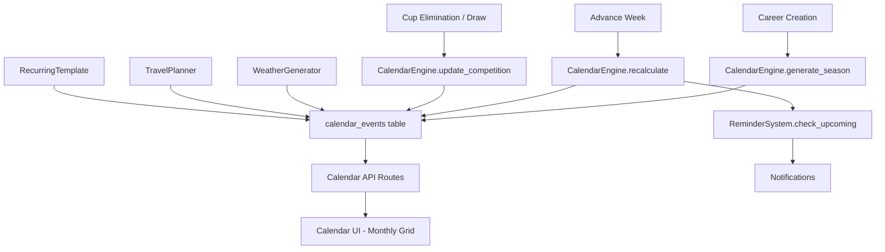
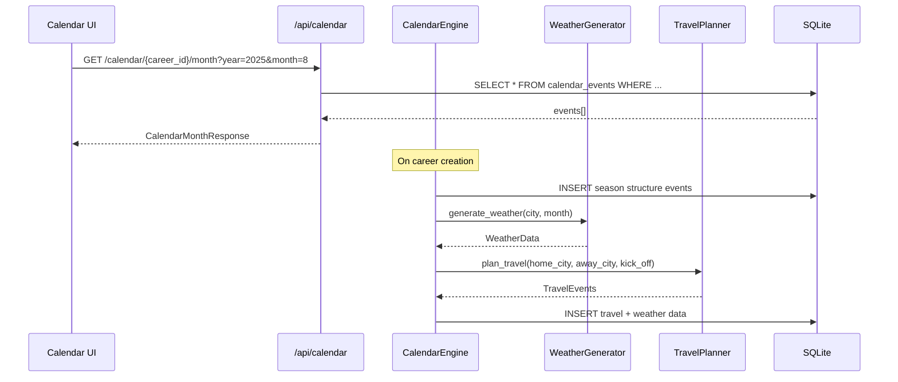

# Design Document: Club Calendar & Schedule

## Overview

The Club Calendar & Schedule system automatically generates and manages a full-season calendar for the player-manager's club. When a career is created, the Calendar Engine produces a structured season (5 blocks, starting July 15) with prioritized event placement — international windows first, then European matches, domestic league, cups, and friendlies. The system handles conflict detection, automatic rescheduling, weather generation, travel planning, recurring templates, and real-time updates when circumstances change (cup eliminations, postponements, suspensions).

The architecture follows the existing project pattern: a FastAPI backend with async SQLAlchemy services, SQLite for local dev, and a vanilla JS frontend in `frontend/index.html`.

---

## Architecture

### High-Level Data Flow



### Component Interaction



### Module Layout

```
app/
├── models/
│   ├── calendar_event.py        # CalendarEvent ORM model
│   ├── league_config.py         # LeagueConfig ORM model
│   └── recurring_template.py    # RecurringTemplate ORM model
├── services/
│   ├── calendar_engine.py       # Core generation, conflicts, rescheduling
│   ├── weather_generator.py     # Weather condition generation
│   ├── travel_planner.py        # Away match travel planning
│   └── reminder_service.py      # Reminder/notification generation
├── api/routes/
│   └── calendar.py              # REST endpoints for calendar
└── data/
    └── league_configs.py        # Static league config data (holidays, windows)
```

---

## Components and Interfaces

### 1. CalendarEngine (`app/services/calendar_engine.py`)

The central orchestrator for all calendar operations.

```python
class CalendarEngine:
    """Generates, manages, and updates the club season calendar."""

    def __init__(self, session: AsyncSession):
        self.session = session
        self.weather = WeatherGenerator()
        self.travel = TravelPlanner()

    # --- Season Generation ---

    async def generate_season(
        self,
        career_id: int,
        club_id: int,
        year: int,
        league_config: LeagueConfig,
    ) -> List[CalendarEvent]:
        """
        Generate a full season calendar for a career.
        Called once on career creation.
        
        Steps:
        1. Create season block markers (milestones)
        2. Place international windows (priority 10)
        3. Place European competition dates (priority 8)
        4. Generate league matchdays (priority 6)
        5. Place domestic cup rounds (priority 4)
        6. Fill pre-season friendlies (priority 2)
        7. Generate training/rest day defaults
        8. Add personal events (birthdays, contract expiries)
        9. Generate weather for all match events
        10. Generate travel for all away matches
        
        Returns: List of all created CalendarEvent records.
        """

    async def place_events_by_priority(
        self,
        career_id: int,
        events: List[CalendarEvent],
    ) -> Tuple[List[CalendarEvent], List[ConflictReport]]:
        """
        Place events respecting priority ordering.
        Returns (placed_events, conflicts).
        """

    # --- Conflict Detection ---

    def detect_conflict(
        self,
        existing_events: List[CalendarEvent],
        new_event: CalendarEvent,
    ) -> Optional[Conflict]:
        """
        Check if new_event conflicts with any existing event.
        Conflict = same club, same date, or within 48h of another match.
        Returns Conflict object or None.
        """

    def detect_overload(
        self,
        events: List[CalendarEvent],
        club_id: int,
        window_days: int = 7,
    ) -> List[OverloadWarning]:
        """
        Detect 3+ matches within a 7-day window for a club.
        Returns list of overload warnings.
        """

    # --- Rescheduling ---

    async def reschedule_event(
        self,
        event: CalendarEvent,
        reason: str,
        max_search_days: int = 7,
    ) -> Optional[CalendarEvent]:
        """
        Find nearest free slot and move event.
        Logs original_date, new_date, reason.
        Returns updated event or None if no slot found.
        """

    async def handle_european_thursday_shift(
        self,
        career_id: int,
        european_match_date: date,
    ) -> Optional[CalendarEvent]:
        """
        When European match is on Thursday, move next league match to Sun/Mon.
        """

    # --- Competition Updates ---

    async def on_cup_elimination(
        self,
        career_id: int,
        competition_id: int,
    ) -> List[CalendarEvent]:
        """
        Remove future cup fixtures, free dates.
        Returns list of cancelled events.
        """

    async def on_new_round_qualified(
        self,
        career_id: int,
        competition_id: int,
        round_dates: List[date],
        opponent_id: Optional[int],
    ) -> List[CalendarEvent]:
        """
        Add new fixture dates for next round.
        """

    # --- Weekly Recalculation ---

    async def recalculate_week(
        self,
        career_id: int,
        current_date: date,
    ) -> RecalculationResult:
        """
        Called on advance_week. Checks for:
        - New draw results needing fixture placement
        - Overload warnings
        - Suspension unavailability
        - Weather updates for upcoming matches
        """

    # --- Query Helpers ---

    async def get_events_for_month(
        self,
        career_id: int,
        year: int,
        month: int,
        event_types: Optional[List[str]] = None,
        team_filter: Optional[str] = None,
    ) -> List[CalendarEvent]:
        """Get all events for a given month with optional filtering."""

    async def get_events_for_date(
        self,
        career_id: int,
        event_date: date,
    ) -> List[CalendarEvent]:
        """Get all events for a specific date."""

    async def get_next_milestone(
        self,
        career_id: int,
        after_date: date,
    ) -> Optional[CalendarEvent]:
        """Get the next upcoming milestone event."""
```

### 2. WeatherGenerator (`app/services/weather_generator.py`)

```python
@dataclass
class WeatherData:
    precipitation: str       # "clear", "rain", "snow", "overcast", "fog"
    temperature_celsius: int
    pitch_condition: str     # "dry", "wet", "muddy", "frozen", "artificial"

@dataclass
class CityClimate:
    avg_temp_by_month: Dict[int, Tuple[int, int]]  # month -> (min, max)
    rain_probability_by_month: Dict[int, float]     # month -> 0.0-1.0
    snow_months: List[int]                          # months where snow possible
    is_cold_climate: bool

class WeatherGenerator:
    """Generates weather conditions based on city climate and calendar month."""

    CLIMATE_PROFILES: Dict[str, CityClimate] = { ... }

    def generate_weather(
        self,
        city: str,
        country: str,
        month: int,
        stadium_type: str = "natural",
    ) -> WeatherData:
        """
        Generate weather for a match day.
        Uses city climate profile + randomization.
        Snow only for cold climates in Nov-Mar.
        Rain probability proportional to historical data.
        """

    def get_climate_profile(self, city: str, country: str) -> CityClimate:
        """Look up or generate a default climate profile for a city."""
```

### 3. TravelPlanner (`app/services/travel_planner.py`)

```python
@dataclass
class TravelPlan:
    transport_mode: str          # "bus" or "plane"
    departure_datetime: datetime
    arrival_datetime: datetime
    return_datetime: datetime
    destination_city: str
    distance_km: int

class TravelPlanner:
    """Plans travel for away matches."""

    BUS_THRESHOLD_KM: int = 300
    BUS_SPEED_KMH: int = 80
    PLANE_SPEED_KMH: int = 800
    ARRIVAL_BUFFER_HOURS: int = 3
    POST_MATCH_HOURS: int = 2

    def plan_travel(
        self,
        home_city: str,
        away_city: str,
        kick_off_time: datetime,
        home_country: str,
        away_country: str,
    ) -> TravelPlan:
        """
        Calculate transport mode and schedule.
        Bus if distance < 300km, plane otherwise.
        Departure = kick_off - travel_time - 3h buffer.
        Return = kick_off + 2h (match duration) + 2h post-match.
        """

    def estimate_distance(
        self,
        city_a: str,
        city_b: str,
        country_a: str,
        country_b: str,
    ) -> int:
        """Estimate distance in km between two cities (lookup table or formula)."""

    def validate_override(
        self,
        new_departure: datetime,
        kick_off_time: datetime,
        distance_km: int,
        transport_mode: str,
    ) -> bool:
        """Validate that a manual override still allows arrival before kick-off."""
```

### 4. ReminderService (`app/services/reminder_service.py`)

```python
@dataclass
class Reminder:
    event_id: int
    reminder_type: str       # "match_prep", "transfer_deadline", "draw", "promise"
    message: str
    trigger_date: date
    is_dismissed: bool = False

class ReminderService:
    """Generates and manages in-game reminders."""

    def __init__(self, session: AsyncSession):
        self.session = session

    async def generate_reminders_for_week(
        self,
        career_id: int,
        current_date: date,
    ) -> List[Reminder]:
        """
        Check events in next 7 days and generate applicable reminders.
        - 2 days before match: tactics review
        - 7 days before transfer deadline: window closing
        - 1 day before draw: competition draw
        - Promise deadlines within 7 days
        No duplicates for same event.
        """

    async def dismiss_reminder(
        self,
        reminder_id: int,
    ) -> None:
        """Mark a reminder as dismissed."""

    async def get_active_reminders(
        self,
        career_id: int,
    ) -> List[Reminder]:
        """Get all undismissed reminders for a career."""
```

### 5. Calendar API Routes (`app/api/routes/calendar.py`)

```python
router = APIRouter(prefix="/calendar", tags=["calendar"])

# GET /api/calendar/{career_id}/month?year=2025&month=8&types=match,training&team=first_team
# -> CalendarMonthResponse (list of events + milestone countdown)

# GET /api/calendar/{career_id}/day?date=2025-08-15
# -> CalendarDayResponse (detailed events for that day)

# POST /api/calendar/{career_id}/template
# -> Create/update recurring template

# GET /api/calendar/{career_id}/template
# -> Get current recurring template

# DELETE /api/calendar/{career_id}/template/{template_id}
# -> Delete a recurring template

# POST /api/calendar/{career_id}/template/{template_id}/apply?month=8&year=2025
# -> Apply template to a month

# PUT /api/calendar/{career_id}/event/{event_id}/travel-override
# -> Override travel departure time or mode

# GET /api/calendar/{career_id}/reminders
# -> Get active reminders

# POST /api/calendar/{career_id}/reminders/{reminder_id}/dismiss
# -> Dismiss a reminder

# GET /api/calendar/{career_id}/international-break?date=2025-09-01
# -> Get called-up players and their fixtures
```

### 6. Calendar UI (Frontend Component in `frontend/index.html`)

The Calendar UI is a vanilla JS component rendered inside the existing single-page app.

Key UI elements:
- **Monthly grid**: 7-column grid (Mon-Sun), color-coded event dots
- **Navigation**: Previous/Next month buttons, month/year header
- **Filter panel**: Toggles for event types (matches, training, international, transfers, medical, days off)
- **Team selector**: Dropdown (First Team, Youth Team, Loaned Players)
- **Day detail panel**: Slide-in panel on day click showing full event details
- **Milestone banner**: Countdown to next milestone in header
- **Template manager**: Weekly grid for recurring event setup

Color coding:
| Event Type | Color |
|---|---|
| Official match | Red (#E53935) |
| Friendly match | Blue (#1E88E5) |
| Training | Green (#43A047) |
| Day off | Grey (#9E9E9E) |
| Transfer deadline | Orange (#FB8C00) |
| Medical | Purple (#8E24AA) |
| International | Flag icon + Gold border |
| Travel | Teal (#00897B) |
| Milestone | Gold (#FFD600) banner |

---

## Data Models

### CalendarEvent (`app/models/calendar_event.py`)

```python
class CalendarEvent(Base):
    __tablename__ = "calendar_events"

    id: Mapped[int] = mapped_column(primary_key=True, autoincrement=True)
    career_id: Mapped[int] = mapped_column(Integer, ForeignKey("careers.id", ondelete="CASCADE"), nullable=False)
    event_date: Mapped[date] = mapped_column(Date, nullable=False)
    event_type: Mapped[str] = mapped_column(String(30), nullable=False)
    # event_type values: match, training, meeting, deadline, international,
    #                    medical, day_off, travel, milestone

    competition_id: Mapped[Optional[int]] = mapped_column(Integer, nullable=True)
    home_club_id: Mapped[Optional[int]] = mapped_column(Integer, ForeignKey("clubs.id"), nullable=True)
    away_club_id: Mapped[Optional[int]] = mapped_column(Integer, ForeignKey("clubs.id"), nullable=True)

    is_locked: Mapped[bool] = mapped_column(Boolean, default=False, nullable=False)
    priority: Mapped[int] = mapped_column(Integer, default=5, nullable=False)
    # priority: 0-10, where 10 = highest (international windows)

    kick_off_time: Mapped[Optional[str]] = mapped_column(String(5), nullable=True)
    # Format: "15:00", "20:00", "21:00"

    weather_data: Mapped[Optional[str]] = mapped_column(Text, nullable=True)
    # JSON: {"precipitation": "rain", "temperature_celsius": 12, "pitch_condition": "wet"}

    description: Mapped[Optional[str]] = mapped_column(Text, nullable=True)
    
    # Travel data (for travel events)
    travel_data: Mapped[Optional[str]] = mapped_column(Text, nullable=True)
    # JSON: {"transport_mode": "plane", "departure": "...", "destination": "..."}

    # Rescheduling log
    original_date: Mapped[Optional[date]] = mapped_column(Date, nullable=True)
    reschedule_reason: Mapped[Optional[str]] = mapped_column(String(255), nullable=True)

    # Soft delete
    is_cancelled: Mapped[bool] = mapped_column(Boolean, default=False, nullable=False)

    # Recurring template reference
    template_id: Mapped[Optional[int]] = mapped_column(Integer, nullable=True)

    # Timestamps
    created_at: Mapped[datetime] = mapped_column(DateTime, server_default=func.now())
    updated_at: Mapped[datetime] = mapped_column(DateTime, server_default=func.now(), onupdate=func.now())

    __table_args__ = (
        Index('idx_calendar_career_date', 'career_id', 'event_date'),
        Index('idx_calendar_career_type', 'career_id', 'event_type'),
        Index('idx_calendar_career_priority', 'career_id', 'priority'),
        CheckConstraint('priority >= 0 AND priority <= 10', name='check_priority_range'),
    )
```

### LeagueConfig (`app/models/league_config.py`)

```python
class LeagueConfig(Base):
    __tablename__ = "league_configs"

    id: Mapped[int] = mapped_column(primary_key=True, autoincrement=True)
    country: Mapped[str] = mapped_column(String(100), nullable=False, unique=True)
    league_name: Mapped[str] = mapped_column(String(255), nullable=False)
    
    has_winter_break: Mapped[bool] = mapped_column(Boolean, default=False)
    winter_break_start: Mapped[Optional[str]] = mapped_column(String(5), nullable=True)  # "01-01" (MM-DD)
    winter_break_end: Mapped[Optional[str]] = mapped_column(String(5), nullable=True)    # "01-31"
    
    mandatory_fixture_dates: Mapped[Optional[str]] = mapped_column(Text, nullable=True)
    # JSON: ["12-26", "01-01"] for Boxing Day + New Year
    
    blackout_dates: Mapped[Optional[str]] = mapped_column(Text, nullable=True)
    # JSON: ["12-25"] for Christmas Day
    
    custom_milestones: Mapped[Optional[str]] = mapped_column(Text, nullable=True)
    # JSON: [{"date": "12-26", "name": "Boxing Day fixtures"}]
    
    season_start_date: Mapped[Optional[str]] = mapped_column(String(5), nullable=True)  # "08-10"
    season_end_date: Mapped[Optional[str]] = mapped_column(String(5), nullable=True)    # "05-15"
    
    european_competition: Mapped[Optional[str]] = mapped_column(String(50), nullable=True)
    # "champions_league", "europa_league", "conference_league", or null
    
    created_at: Mapped[datetime] = mapped_column(DateTime, server_default=func.now())
```

### RecurringTemplate (`app/models/recurring_template.py`)

```python
class RecurringTemplate(Base):
    __tablename__ = "recurring_templates"

    id: Mapped[int] = mapped_column(primary_key=True, autoincrement=True)
    career_id: Mapped[int] = mapped_column(Integer, ForeignKey("careers.id", ondelete="CASCADE"), nullable=False)
    name: Mapped[str] = mapped_column(String(100), nullable=False)
    
    # Day assignments as JSON
    # {"monday": "tactical_theory", "tuesday": "practice_match", "wednesday": "rest", ...}
    day_assignments: Mapped[str] = mapped_column(Text, nullable=False)
    
    is_active: Mapped[bool] = mapped_column(Boolean, default=True)
    
    created_at: Mapped[datetime] = mapped_column(DateTime, server_default=func.now())
    updated_at: Mapped[datetime] = mapped_column(DateTime, server_default=func.now(), onupdate=func.now())

    __table_args__ = (
        Index('idx_template_career', 'career_id'),
    )
```

### Supporting Data Classes

```python
# In calendar_engine.py

@dataclass
class SeasonBlock:
    name: str           # "pre_season", "first_half", "winter_break", "second_half", "season_finish"
    start_date: date
    end_date: date

@dataclass
class Conflict:
    existing_event: CalendarEvent
    new_event: CalendarEvent
    conflict_type: str  # "same_date", "48h_rule", "overload"
    suggested_date: Optional[date]

@dataclass
class ConflictReport:
    event: CalendarEvent
    conflict: Conflict
    resolved: bool
    resolution: Optional[str]

@dataclass
class OverloadWarning:
    club_id: int
    start_date: date
    end_date: date
    match_count: int
    lowest_priority_event: CalendarEvent

@dataclass
class RecalculationResult:
    new_events: List[CalendarEvent]
    rescheduled_events: List[CalendarEvent]
    cancelled_events: List[CalendarEvent]
    warnings: List[OverloadWarning]
    reminders: List[Reminder]

@dataclass 
class KickOffSlot:
    day_of_week: str    # "saturday", "sunday", "friday", "monday"
    time: str           # "15:00", "12:30", "16:30", "20:00"
    is_tv_slot: bool
    revenue_multiplier: float  # 1.0 for default, 1.3-1.5 for TV slots
```

### Database Schema (SQLite via `run_local.py`)

New tables to add in `create_tables()`:

```python
Table('calendar_events', metadata,
    Column('id', Integer, primary_key=True),
    Column('career_id', Integer, nullable=False),
    Column('event_date', String(10), nullable=False),  # "2025-08-15"
    Column('event_type', String(30), nullable=False),
    Column('competition_id', Integer, nullable=True),
    Column('home_club_id', Integer, nullable=True),
    Column('away_club_id', Integer, nullable=True),
    Column('is_locked', Boolean, default=False),
    Column('priority', Integer, default=5),
    Column('kick_off_time', String(5), nullable=True),
    Column('weather_data', Text, nullable=True),
    Column('description', Text, nullable=True),
    Column('travel_data', Text, nullable=True),
    Column('original_date', String(10), nullable=True),
    Column('reschedule_reason', String(255), nullable=True),
    Column('is_cancelled', Boolean, default=False),
    Column('template_id', Integer, nullable=True),
    Column('created_at', DateTime, server_default=func.now()),
    Column('updated_at', DateTime, server_default=func.now()),
)

Table('league_configs', metadata,
    Column('id', Integer, primary_key=True),
    Column('country', String(100), unique=True, nullable=False),
    Column('league_name', String(255), nullable=False),
    Column('has_winter_break', Boolean, default=False),
    Column('winter_break_start', String(5), nullable=True),
    Column('winter_break_end', String(5), nullable=True),
    Column('mandatory_fixture_dates', Text, nullable=True),
    Column('blackout_dates', Text, nullable=True),
    Column('custom_milestones', Text, nullable=True),
    Column('season_start_date', String(5), nullable=True),
    Column('season_end_date', String(5), nullable=True),
    Column('european_competition', String(50), nullable=True),
    Column('created_at', DateTime, server_default=func.now()),
)

Table('recurring_templates', metadata,
    Column('id', Integer, primary_key=True),
    Column('career_id', Integer, nullable=False),
    Column('name', String(100), nullable=False),
    Column('day_assignments', Text, nullable=False),
    Column('is_active', Boolean, default=True),
    Column('created_at', DateTime, server_default=func.now()),
    Column('updated_at', DateTime, server_default=func.now()),
)
```

---


## Correctness Properties

*A property is a characteristic or behavior that should hold true across all valid executions of a system — essentially, a formal statement about what the system should do. Properties serve as the bridge between human-readable specifications and machine-verifiable correctness guarantees.*

### Property 1: Season structure invariant

*For any* valid year and league configuration, the generated season SHALL consist of exactly 5 non-overlapping, contiguous blocks starting on July 15 and ending no later than June 14 of the following year.

**Validates: Requirements 1.1, 1.2, 1.12**

### Property 2: Priority ordering preservation

*For any* generated calendar, no event with a lower priority value SHALL occupy a date that conflicts with an event of higher priority for the same club. Specifically: international (10) > European (8) > league (6) > cup (4) > friendly (2).

**Validates: Requirements 2.1, 3.2**

### Property 3: Day-of-week constraints

*For any* generated calendar event of type match: European competition matches SHALL fall on Tuesday, Wednesday, or Thursday; domestic league matches SHALL fall on Friday, Saturday, Sunday, or Monday; domestic cup matches SHALL fall on Tuesday, Wednesday, or Thursday.

**Validates: Requirements 2.2, 2.3, 2.4, 2.8, 2.9**

### Property 4: Friendly non-conflict

*For any* friendly match event in the calendar, no other event SHALL exist on the same date for the same career.

**Validates: Requirements 1.8, 2.5**

### Property 5: 48-hour match separation

*For any* generated calendar, no two match events for the same club SHALL be scheduled within 48 hours of each other.

**Validates: Requirements 3.8**

### Property 6: Winter break enforcement

*For any* league configuration with `has_winter_break=True`, the generated calendar SHALL contain zero league match events during the configured winter break period (default: January 1–31).

**Validates: Requirements 1.9, 18.3**

### Property 7: Blackout date enforcement

*For any* league configuration, no match event SHALL be scheduled on December 25. Additionally, for any date listed in the league's `blackout_dates` configuration, no match event SHALL exist.

**Validates: Requirements 18.4, 18.5**

### Property 8: Kick-off time assignment

*For any* match event in the calendar: league matches on Saturday without TV slot SHALL have kick_off_time "15:00"; TV-slot matches SHALL have one of "20:00", "12:30", "16:30"; European matches SHALL have "21:00"; domestic cup matches SHALL have "20:00". All match events SHALL have a non-null kick_off_time.

**Validates: Requirements 4.1, 4.2, 4.4, 4.5, 4.6**

### Property 9: Conflict resolution with suggestion

*For any* new event that conflicts with an existing higher-priority event, the Calendar Engine SHALL reject placement and return a suggested alternative date that is free of conflicts.

**Validates: Requirements 3.2**

### Property 10: Rescheduling audit trail

*For any* event that has been rescheduled, the `original_date` field SHALL be non-null and the `reschedule_reason` field SHALL be a non-empty string.

**Validates: Requirements 3.7**

### Property 11: Locked event immutability

*For any* event with `is_locked=True`, the reschedule operation SHALL refuse to move it (return None or raise an error), preserving the original date.

**Validates: Requirements 6.3**

### Property 12: Cup elimination cleanup

*For any* career where a club is eliminated from a competition, all future calendar events for that competition SHALL be marked as cancelled (is_cancelled=True) and their dates freed for other events.

**Validates: Requirements 3.5, 17.1**

### Property 13: Overload detection

*For any* set of calendar events where 3 or more matches for the same club fall within a 7-day window, the `detect_overload` function SHALL return a non-empty list of warnings identifying the lowest-priority match.

**Validates: Requirements 3.6, 17.3**

### Property 14: Weather generation bounds

*For any* city and month, the Weather Generator SHALL produce: temperature within the city's climate profile min/max range for that month; precipitation "snow" only when `is_cold_climate=True` AND month is in [11, 12, 1, 2, 3]; pitch_condition "artificial" if and only if stadium_type is "artificial".

**Validates: Requirements 5.1, 5.2, 5.3, 5.6, 5.7**

### Property 15: Travel timing validity

*For any* away match, the Travel Planner SHALL generate a travel plan where: transport_mode is "bus" if distance < 300km, "plane" otherwise; arrival_datetime is at least 3 hours before kick_off_time; return_datetime is approximately kick_off + 4 hours.

**Validates: Requirements 13.1, 13.2, 13.3, 13.4**

### Property 16: Travel override validation

*For any* manual travel override, the system SHALL reject the override if the new departure time does not allow arrival before kick-off given the distance and transport mode.

**Validates: Requirements 13.7**

### Property 17: Pre-match day schedule

*For any* match event, the calendar day immediately preceding it SHALL contain pre-match preparation events (light warmup, tactical theory) and SHALL NOT contain normal training events. For away matches, the pre-match day SHALL additionally contain a hotel check-in event.

**Validates: Requirements 12.1, 12.2, 12.3, 12.4, 12.5**

### Property 18: Template respects priority

*For any* recurring template application to a month, generated events SHALL NOT be placed on days that already have a match, international break, or any event with `is_locked=True`.

**Validates: Requirements 14.3, 14.4**

### Property 19: Reminder uniqueness

*For any* event in the calendar, the Reminder System SHALL generate at most one reminder of each type (match_prep, transfer_deadline, draw, promise) per event. Calling `generate_reminders_for_week` multiple times SHALL NOT create duplicate reminders.

**Validates: Requirements 11.6**

### Property 20: Soft deletion exclusion

*For any* event with `is_cancelled=True`, standard query methods (get_events_for_month, get_events_for_date) SHALL NOT include it in results.

**Validates: Requirements 6.8**

### Property 21: Holiday fixture locking

*For any* mandatory fixture date defined in a league configuration, the generated calendar event SHALL have `is_locked=True` and `priority=9`.

**Validates: Requirements 18.6**

### Property 22: Season milestones completeness

*For any* generated calendar, milestone events SHALL exist for all required dates: summer transfer window open (July 1), season start (July 15), summer window close (August 31), winter window open (January 1), winter window close (January 31), last league matchday, and any custom milestones defined in the league configuration.

**Validates: Requirements 16.1, 16.4**

---

## Error Handling

### CalendarEngine Errors

| Error Scenario | Handling Strategy |
|---|---|
| No free slot within 7 days for reschedule | Return `None`, escalate to player-manager with manual resolution options (Req 3.10) |
| Invalid event_type value | Raise `ValueError` with list of valid types |
| Career not found | Raise `CareerNotFoundError` (HTTP 404) |
| Conflict with locked event | Skip placement, log warning, return conflict report |
| Database write failure | Rollback transaction, raise `CalendarServiceError` |
| Overload detected (3+ matches/7 days) | Return `OverloadWarning` in response, do not auto-resolve |

### WeatherGenerator Errors

| Error Scenario | Handling Strategy |
|---|---|
| Unknown city (no climate profile) | Fall back to country-level default profile |
| Unknown country | Use global temperate default (10-20°C, 30% rain) |

### TravelPlanner Errors

| Error Scenario | Handling Strategy |
|---|---|
| Unknown city pair (no distance data) | Estimate using country-level average (domestic: 200km, international: 1500km) |
| Override validation fails | Return `False` with explanation message |
| Same city (home = away) | Return minimal travel plan (bus, 30min, no hotel) |

### API Error Responses

```python
# Standard error response format
class CalendarErrorResponse(BaseModel):
    error: str
    detail: str
    suggested_action: Optional[str] = None

# HTTP Status Codes:
# 400 - Invalid parameters (bad date format, invalid event_type)
# 404 - Career or event not found
# 409 - Conflict detected (with suggested_date in response)
# 422 - Validation error (travel override fails)
# 500 - Internal server error (DB failure)
```

### Graceful Degradation

- If weather generation fails, match events are created without weather_data (null)
- If travel planning fails, away matches are created without travel events (logged as warning)
- If reminder generation fails during advance_week, week still advances (reminders are non-critical)

---

## Testing Strategy

### Property-Based Testing (PBT)

This feature is well-suited for property-based testing because:
- The Calendar Engine has pure logic functions with clear input/output behavior
- Universal properties hold across a wide range of inputs (any league config, any year, any set of events)
- The input space is large (combinations of leagues, dates, priorities, weather parameters)

**PBT Library**: `hypothesis` (Python)

**Configuration**: Minimum 100 iterations per property test.

**Tag format**: `Feature: club-calendar-schedule, Property {N}: {property_text}`

Each of the 22 correctness properties above will be implemented as a single property-based test using Hypothesis strategies to generate:
- Random league configurations (winter break on/off, various blackout dates)
- Random event sets with varying priorities and dates
- Random city/month combinations for weather
- Random distance/time combinations for travel

### Unit Tests (Example-Based)

Focus areas:
- Specific league configs (English Boxing Day, German winter pause)
- Edge cases: season boundary dates, leap years, Feb 29
- Cup elimination flow (create fixtures → eliminate → verify removal)
- Advance week integration (verify recalculate is called)
- API endpoint response formats
- Template CRUD operations

### Integration Tests

- Career creation → calendar generation end-to-end
- Advance week → reminder generation → notification delivery
- Cup draw result → new fixtures added → overload check
- Full season simulation (52 weeks) verifying no invariant violations

### Frontend Tests

- Manual testing of monthly grid rendering
- Filter toggle behavior
- Day detail panel content
- Responsive layout on mobile widths
- Milestone countdown accuracy

