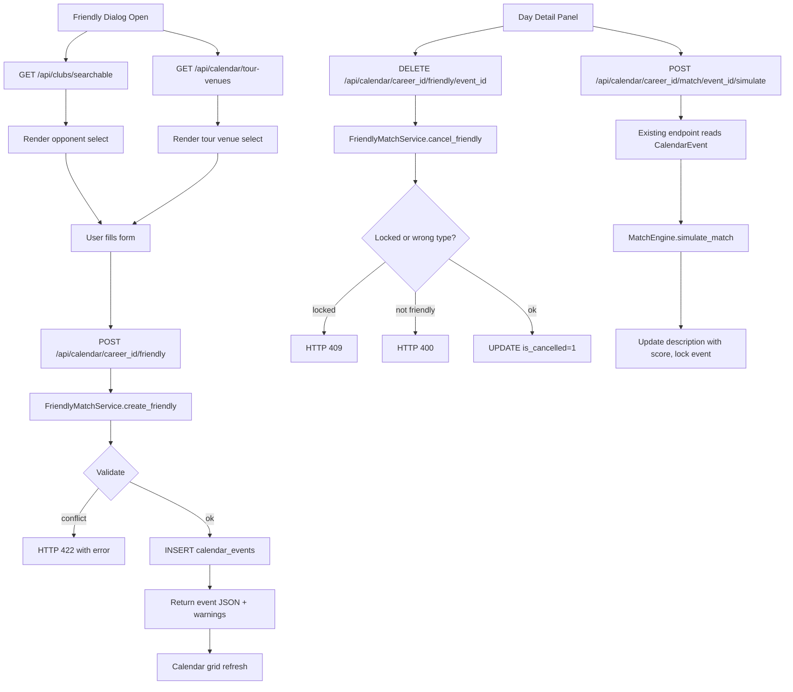
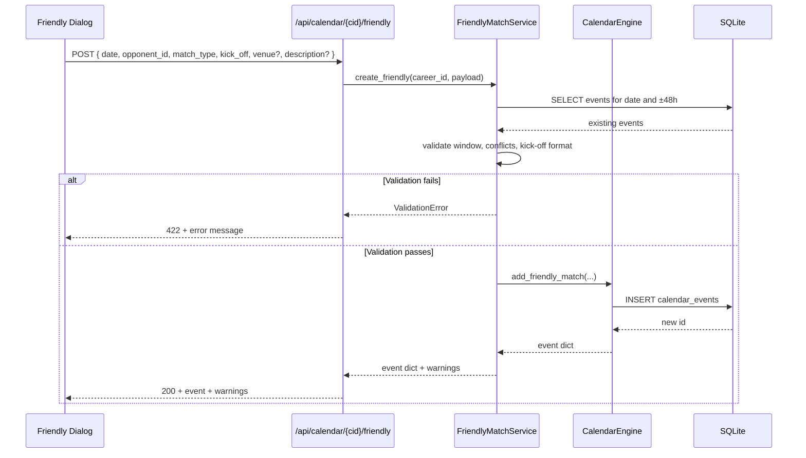

# Design Document: Товарищеские матчи (User-Arranged Friendlies)

## Overview

The Friendly Matches feature lets the player-manager schedule custom friendly matches between their club and any other club from the existing `CLUBS` registry. The feature extends the existing `CalendarEngine` and `calendar_events` table — no new tables are introduced. A new module `app/services/friendly_match_service.py` (functionally a thin wrapper around `CalendarEngine.add_friendly_match`) handles validation: date in season, no conflict with locked or higher-priority events, no double-booking. New API endpoints under `/api/calendar/{career_id}/friendly` create and cancel friendlies, and a new endpoint `/api/clubs/searchable` returns the opponent list. The existing `POST /api/calendar/{career_id}/match/{event_id}/simulate` endpoint already handles all match events including friendlies, so simulation requires no backend changes — only that the friendly's `description` is parseable by the existing simulator. The frontend adds a `Friendly_Dialog` modal with date picker, opponent search/filter, match type radio group, optional tour venue select, kick-off time, and description input. Tour venues come from a static module `app/data/tour_venues.py`.

The architecture follows the existing project pattern: FastAPI async endpoints, raw SQL via `text()` for SQLite compatibility, vanilla-JS UI inside `frontend/index.html` (or its modular split under `frontend/src/`).

---

## Architecture

### High-Level Data Flow



### Component Interaction



### Module Layout

```
app/
├── data/
│   └── tour_venues.py             # NEW: static list of commercial tour venues
├── services/
│   ├── calendar_engine.py         # MODIFIED: add `add_friendly_match` method
│   └── friendly_match_service.py  # NEW: validation + orchestration wrapper
├── api/routes/
│   ├── calendar.py                # MODIFIED: add friendly + tour-venues routes
│   └── clubs.py                   # MODIFIED: add /clubs/searchable route
└── models/
    └── calendar_event.py          # UNCHANGED: existing model is sufficient

frontend/
└── (index.html OR src/ui/screens/CalendarScreen.js)
    ├── FriendlyDialog component    # NEW
    └── DayDetailPanel              # MODIFIED: add cancel + new entry-point button
```

---

## Components and Interfaces

### 1. Tour venues data (`app/data/tour_venues.py`)

Static module returning a fixed list of internationally recognised stadiums used for pre-season commercial tours. Each entry follows the same shape as `CLUBS` (a tuple) and is wrapped by a helper for API exposure.

```python
# app/data/tour_venues.py

TOUR_VENUES = [
    # (id, city, country, stadium_name)
    (1, "Майами",       "США",            "Hard Rock Stadium"),
    (2, "Нью-Йорк",     "США",            "MetLife Stadium"),
    (3, "Лос-Анджелес", "США",            "SoFi Stadium"),
    (4, "Токио",        "Япония",         "National Stadium"),
    (5, "Сингапур",     "Сингапур",       "National Stadium"),
    (6, "Эр-Рияд",      "Саудовская Аравия", "King Fahd International Stadium"),
    (7, "Сидней",       "Австралия",      "Stadium Australia"),
    (8, "Мехико",       "Мексика",        "Estadio Azteca"),
]


def get_tour_venues() -> list[dict]:
    """Returns the tour venues as a list of dicts for the API."""
    return [
        {"id": vid, "city": city, "country": country, "stadium_name": stadium}
        for vid, city, country, stadium in TOUR_VENUES
    ]


def get_tour_venue_by_id(venue_id: int) -> dict | None:
    """Look up a single venue by id; returns None if not found."""
    for vid, city, country, stadium in TOUR_VENUES:
        if vid == venue_id:
            return {"id": vid, "city": city, "country": country, "stadium_name": stadium}
    return None
```

### 2. FriendlyMatchService (`app/services/friendly_match_service.py`)

The service owns all validation and is the only entry point for HTTP routes. It depends on `CalendarEngine` for the actual insert and on `tour_venues` for venue lookup. Validation produces both hard errors (raised as `ValidationError`) and soft warnings (returned in the response `warnings` list).

```python
# app/services/friendly_match_service.py

import json
import re
from dataclasses import dataclass, field
from datetime import date, datetime, timedelta
from typing import List, Optional

from sqlalchemy import text
from sqlalchemy.ext.asyncio import AsyncSession

from app.data.club_budgets import CLUBS
from app.data.tour_venues import get_tour_venue_by_id


KICK_OFF_REGEX = re.compile(r"^([01]\d|2[0-3]):[0-5]\d$")
VALID_MATCH_TYPES = {"home", "away", "commercial_tour", "closed_door"}
PRESEASON_START_MMDD = (7, 15)
PRESEASON_END_MMDD = (8, 10)


@dataclass
class FriendlyCreateRequest:
    """Validated input for creating a friendly match."""
    event_date: date
    opponent_club_id: int
    match_type: str        # "home", "away", "commercial_tour", "closed_door"
    kick_off_time: str = "18:00"
    tour_venue_id: Optional[int] = None
    description_suffix: Optional[str] = None  # user-provided extra text


@dataclass
class FriendlyCreateResult:
    """Result of a successful friendly creation."""
    event_id: int
    event_date: date
    kick_off_time: str
    home_club_id: int
    away_club_id: int
    description: str
    travel_data: dict
    warnings: List[str] = field(default_factory=list)


class ValidationError(Exception):
    """Raised when a friendly cannot be created due to validation rules.

    Carries a Russian-language error message intended for direct surface to the user.
    """
    def __init__(self, message: str, http_status: int = 422):
        super().__init__(message)
        self.message = message
        self.http_status = http_status


class FriendlyMatchService:
    """Validates user-arranged friendly matches and persists them."""

    def __init__(self, session: AsyncSession):
        self.session = session

    # --- Public API ---

    async def create_friendly(
        self,
        career_id: int,
        request: FriendlyCreateRequest,
    ) -> FriendlyCreateResult:
        """
        Validate and create a user-arranged friendly match.

        Steps:
        1. Validate match_type, kick-off time format, opponent existence, tour venue.
        2. Look up player's club id from career.
        3. Resolve season window from career start year (year of earliest event).
        4. Run conflict checks against existing calendar_events for this career on
           and around event_date.
        5. Build description and travel_data JSON.
        6. INSERT into calendar_events.
        7. Return FriendlyCreateResult with parsed travel_data and any warnings.
        """

    async def cancel_friendly(
        self,
        career_id: int,
        event_id: int,
    ) -> int:
        """
        Soft-cancel a friendly match.

        Steps:
        1. SELECT the row by (id, career_id, is_cancelled=0).
        2. If not found -> raise ValidationError(404, "Товарищеский матч не найден").
        3. If event_type != "match" or priority != 2 -> raise ValidationError(400).
        4. If is_locked=1 -> raise ValidationError(409, "Нельзя отменить уже сыгранный матч").
        5. UPDATE calendar_events SET is_cancelled=1 WHERE id=?.
        6. Return event_id.
        """

    # --- Validation helpers (pure, internal) ---

    def _validate_match_type(self, match_type: str) -> None:
        """Raise ValidationError if match_type is not in VALID_MATCH_TYPES."""

    def _validate_kick_off(self, kick_off_time: str) -> None:
        """Raise ValidationError if kick_off_time does not match KICK_OFF_REGEX."""

    def _validate_opponent(self, opponent_club_id: int, player_club_id: int) -> None:
        """Raise ValidationError if opponent_club_id is invalid or equals player's club."""

    def _validate_tour_venue(self, match_type: str, tour_venue_id: Optional[int]) -> dict | None:
        """Look up venue when match_type=commercial_tour; raise if missing."""

    async def _get_player_club_id(self, career_id: int) -> int:
        """Read careers.club_id; raise if career missing."""

    async def _resolve_season_window(self, career_id: int) -> tuple[date, date]:
        """
        Determine the season's start and end dates by reading the earliest and
        latest event_date values for this career. If absent, defaults to
        (today, today + 365 days).
        """

    async def _existing_events_around(
        self,
        career_id: int,
        event_date: date,
    ) -> list[dict]:
        """
        SELECT non-cancelled events for this career within ±2 days of event_date.
        Returns list of dicts with id, event_date, event_type, priority, is_locked.
        """

    def _check_window(
        self,
        event_date: date,
        season_start: date,
        season_end: date,
    ) -> List[str]:
        """
        Return [] if hard-valid; raise ValidationError if outside season.
        Append "Дата вне предсезонного окна" warning if outside July 15 – August 10
        of the start year (and not within an international break gap, checked separately).
        """

    def _check_conflicts(
        self,
        event_date: date,
        existing: list[dict],
    ) -> List[str]:
        """
        Apply the rules from Requirement 5. Raises ValidationError on hard
        conflicts; returns a list of warnings for soft conflicts (Requirement 12.3).

        Hard conflicts (raise ValidationError):
          - Same date with priority >= 4
          - Same date with is_locked=True
          - Inside event_type=international event
          - Within 48h of another match for this career
          - Same date with another non-cancelled friendly (priority=2) for this career

        Soft warnings (returned):
          - Date is inside an international break window's day range but not the
            anchor day (Requirement 12.3): "Часть игроков на международных матчах"
          - Date outside pre-season window: "Дата вне предсезонного окна"
        """

    def _build_description(
        self,
        match_type: str,
        home_name: str,
        away_name: str,
        venue: dict | None,
        suffix: Optional[str],
    ) -> str:
        """
        Compose the description per Requirement 6.2-6.4:
          base = "Товарищеский матч: {home_name} – {away_name}"
          closed_door -> base + " (закрытый)"
          commercial_tour -> base + f" — {venue['city']}"
          if suffix: base + f" [{suffix}]"
        """

    def _build_travel_data(
        self,
        match_type: str,
        venue: dict | None,
    ) -> dict:
        """
        Build the JSON-serializable travel_data per Requirement 6.5-6.7.
        - home/away -> {"match_subtype": match_type}
        - closed_door -> {"match_subtype": "closed_door", "venue": "training_ground"}
        - commercial_tour -> {"match_subtype": "commercial_tour", "city": ..., "country": ..., "stadium_name": ...}
        """

    def _resolve_home_away(
        self,
        match_type: str,
        player_club_id: int,
        opponent_club_id: int,
    ) -> tuple[int, int]:
        """
        Returns (home_club_id, away_club_id) per Requirement 3.4-3.7.
        - home, commercial_tour, closed_door -> (player, opponent)
        - away -> (opponent, player)
        """
```

### 3. CalendarEngine extension (`app/services/calendar_engine.py`)

A single new method is appended to the existing class. It is intentionally thin: validation is the responsibility of `FriendlyMatchService`. This method is only the persistence step.

```python
# Added to existing CalendarEngine class

async def add_friendly_match(
    self,
    career_id: int,
    event_date: date,
    home_club_id: int,
    away_club_id: int,
    kick_off_time: str,
    description: str,
    travel_data: dict,
) -> dict:
    """
    Insert a single user-arranged friendly into calendar_events.
    Returns the created event as a dict including the new id.

    The caller is responsible for validation. This method does not
    re-validate; it only inserts and reads back.
    """
    travel_json = json.dumps(travel_data, ensure_ascii=False) if travel_data else None
    result = await self.session.execute(
        text("""
            INSERT INTO calendar_events
            (career_id, event_date, event_type, home_club_id, away_club_id,
             is_locked, priority, kick_off_time, description, travel_data,
             is_cancelled)
            VALUES
            (:career_id, :event_date, 'match', :home_club_id, :away_club_id,
             0, 2, :kick_off_time, :description, :travel_data, 0)
        """),
        {
            "career_id": career_id,
            "event_date": str(event_date),
            "home_club_id": home_club_id,
            "away_club_id": away_club_id,
            "kick_off_time": kick_off_time,
            "description": description,
            "travel_data": travel_json,
        },
    )
    await self.session.commit()
    id_row = await self.session.execute(text("SELECT last_insert_rowid()"))
    new_id = id_row.scalar() or 0

    return {
        "id": new_id,
        "career_id": career_id,
        "event_date": str(event_date),
        "event_type": "match",
        "home_club_id": home_club_id,
        "away_club_id": away_club_id,
        "is_locked": False,
        "priority": 2,
        "kick_off_time": kick_off_time,
        "description": description,
        "travel_data": travel_data,
        "is_cancelled": False,
    }
```

### 4. API endpoints

Three new endpoints + one new endpoint on the clubs router. All return JSON; all errors return `{"detail": "..."}` per FastAPI convention.

```python
# app/api/routes/calendar.py — additions

class FriendlyCreatePayload(BaseModel):
    event_date: str = Field(..., description="YYYY-MM-DD")
    opponent_club_id: int = Field(..., ge=1)
    match_type: str = Field(..., pattern="^(home|away|commercial_tour|closed_door)$")
    kick_off_time: str = Field("18:00")
    tour_venue_id: Optional[int] = None
    description_suffix: Optional[str] = Field(None, max_length=80)


@router.post("/{career_id}/friendly", status_code=201)
async def create_friendly(
    career_id: int,
    payload: FriendlyCreatePayload,
    db: AsyncSession = Depends(get_db),
):
    """Create a user-arranged friendly match. See Requirements 1, 3, 5, 6."""
    from app.services.friendly_match_service import (
        FriendlyMatchService,
        FriendlyCreateRequest,
        ValidationError as FriendlyValidationError,
    )
    try:
        ev_date = date.fromisoformat(payload.event_date)
    except ValueError:
        raise HTTPException(422, "Неверный формат даты")

    service = FriendlyMatchService(db)
    try:
        result = await service.create_friendly(
            career_id,
            FriendlyCreateRequest(
                event_date=ev_date,
                opponent_club_id=payload.opponent_club_id,
                match_type=payload.match_type,
                kick_off_time=payload.kick_off_time,
                tour_venue_id=payload.tour_venue_id,
                description_suffix=payload.description_suffix,
            ),
        )
    except FriendlyValidationError as ve:
        raise HTTPException(ve.http_status, ve.message)

    return {
        "id": result.event_id,
        "event_date": str(result.event_date),
        "kick_off_time": result.kick_off_time,
        "home_club_id": result.home_club_id,
        "away_club_id": result.away_club_id,
        "description": result.description,
        "travel_data": result.travel_data,
        "warnings": result.warnings,
    }


@router.delete("/{career_id}/friendly/{event_id}")
async def cancel_friendly(
    career_id: int,
    event_id: int,
    db: AsyncSession = Depends(get_db),
):
    """Soft-cancel a user-arranged friendly. See Requirements 8.1-8.5."""
    from app.services.friendly_match_service import (
        FriendlyMatchService,
        ValidationError as FriendlyValidationError,
    )
    service = FriendlyMatchService(db)
    try:
        cancelled_id = await service.cancel_friendly(career_id, event_id)
    except FriendlyValidationError as ve:
        raise HTTPException(ve.http_status, ve.message)
    return {"success": True, "event_id": cancelled_id}


@router.get("/tour-venues")
async def list_tour_venues():
    """List commercial-tour venues. See Requirement 4.1."""
    from app.data.tour_venues import get_tour_venues
    return {"venues": get_tour_venues()}
```

```python
# app/api/routes/clubs.py — addition

@router.get("/searchable")
async def list_searchable_clubs(
    exclude_career_id: int | None = Query(default=None, ge=1),
    db: AsyncSession = Depends(get_db),
):
    """
    Lightweight listing for the friendly opponent picker. See Requirement 2.1, 2.6.
    Returns id (1-based), name, league, country (parsed from league emoji prefix).
    Excludes the career's club when exclude_career_id is provided.
    """
    from app.data.club_budgets import CLUBS
    excluded_id = None
    if exclude_career_id is not None:
        result = await db.execute(
            text("SELECT club_id FROM careers WHERE id = :cid"),
            {"cid": exclude_career_id},
        )
        row = result.fetchone()
        if row:
            excluded_id = row[0]

    items = []
    for idx, (name, _scout, _trans, league) in enumerate(CLUBS, start=1):
        if idx == excluded_id:
            continue
        items.append({"id": idx, "name": name, "league": league})
    return {"clubs": items, "total": len(items)}
```

### 5. Frontend Friendly_Dialog

The dialog is a modal added to the existing calendar screen. It is a single component file (in the modular UI under `frontend/src/ui/screens/CalendarScreen.js`, or a `<dialog>` block in `index.html` for the legacy single-file build). The dialog calls the three new endpoints on open, then `POST /api/calendar/{career_id}/friendly` on submit.

UI layout:

```
┌─────────────────────────────────────────┐
│ Запланировать товарищеский матч       × │
├─────────────────────────────────────────┤
│ Дата           [2025-07-22         ]    │
│                                         │
│ Соперник       [Поиск...           ]    │
│                [Лига: Все лиги    ▼]    │
│                ┌──────────────────────┐ │
│                │ ⚪ Барселона  La Liga│ │
│                │ ⚪ Милан     Serie A │ │
│                │ ⚪ Ливерпуль PL      │ │
│                └──────────────────────┘ │
│                                         │
│ Тип матча      ⚪ Домашний              │
│                ⚪ Выездной              │
│                ⚪ Коммерческий тур      │
│                ⚪ Закрытый              │
│                                         │
│ Площадка тура  [Майами, США — Hard… ▼]  │
│   (visible only for commercial_tour)    │
│                                         │
│ Время начала   [18:00 ▼]                │
│ Описание (опц) [____________________]   │
│                                         │
│ ⚠ Warnings banner (if any from server)  │
│                                         │
│              [ Отмена ]  [ Создать ]    │
└─────────────────────────────────────────┘
```

Color coding (existing scheme): friendly events render in blue `#1E88E5` in the monthly grid; the dialog uses `#1E88E5` accent borders to match.

DayDetailPanel modification:

When a day is clicked:
- If the day has at least one event with `event_type=="match"` and `priority==2` and `is_locked==False`, the panel shows three buttons per friendly: "▶ Играть матч", "⏭ Пропустить (авто)", "Отменить".
- If the day has no event for this career, the panel shows the action "Запланировать товарищеский на эту дату" (Requirement 10.2).
- Friendly events display the icon "🤝" and (when applicable) the "🌐 {city}" or "🚪 Закрытый матч" suffix (Requirement 9).

---

## Data Models

### CalendarEvent (existing, no migration)

The friendly matches feature reuses the existing `calendar_events` table without schema changes. The relevant column usage for a user-arranged friendly:

| Column            | Value for user-arranged friendly                            |
|-------------------|-------------------------------------------------------------|
| `id`              | auto-increment                                              |
| `career_id`       | the career id from the URL                                  |
| `event_date`      | the user-selected date (`date`)                             |
| `event_type`      | `"match"`                                                   |
| `competition_id`  | `NULL`                                                      |
| `home_club_id`    | resolved per match_type (Requirement 3.4-3.7)               |
| `away_club_id`    | resolved per match_type                                     |
| `is_locked`       | `False` until simulated, then `True`                        |
| `priority`        | `2`                                                         |
| `kick_off_time`   | user-supplied or default `"18:00"`                          |
| `weather_data`    | `NULL` (friendly weather is not generated for now)          |
| `description`     | "Товарищеский матч: {home} – {away}" + suffixes             |
| `travel_data`     | JSON describing match subtype and (if tour) venue           |
| `original_date`   | `NULL`                                                      |
| `reschedule_reason`| `NULL`                                                     |
| `is_cancelled`    | `False` initially, `True` after DELETE                      |
| `template_id`     | `NULL`                                                      |

### travel_data JSON shape

```typescript
type FriendlyTravelData =
  | { match_subtype: "home" }
  | { match_subtype: "away" }
  | { match_subtype: "closed_door"; venue: "training_ground" }
  | {
      match_subtype: "commercial_tour";
      city: string;
      country: string;
      stadium_name: string;
    };
```

### Tour venue record (in-memory tuple)

```python
TourVenueRecord = tuple[int, str, str, str]  # (id, city, country, stadium_name)
```

### API request/response shapes

```typescript
// POST /api/calendar/{career_id}/friendly request body
type FriendlyCreatePayload = {
  event_date: string;       // "YYYY-MM-DD"
  opponent_club_id: number; // 1-based id from CLUBS
  match_type: "home" | "away" | "commercial_tour" | "closed_door";
  kick_off_time?: string;   // "HH:MM", default "18:00"
  tour_venue_id?: number;   // required iff match_type === "commercial_tour"
  description_suffix?: string;
};

// 201 Created response body
type FriendlyCreateResponse = {
  id: number;
  event_date: string;
  kick_off_time: string;
  home_club_id: number;
  away_club_id: number;
  description: string;
  travel_data: FriendlyTravelData;
  warnings: string[];
};

// GET /api/calendar/tour-venues response body
type TourVenuesResponse = {
  venues: { id: number; city: string; country: string; stadium_name: string }[];
};

// GET /api/clubs/searchable response body
type SearchableClubsResponse = {
  clubs: { id: number; name: string; league: string }[];
  total: number;
};

// DELETE /api/calendar/{career_id}/friendly/{event_id} response body
type FriendlyCancelResponse = { success: true; event_id: number };
```

---


## Correctness Properties

*A property is a characteristic or behavior that should hold true across all valid executions of a system — essentially, a formal statement about what the system should do. Properties serve as the bridge between human-readable specifications and machine-verifiable correctness guarantees.*

### Property 1: Searchable clubs API excludes the player's own club

*For any* career id with a valid `club_id` in the `careers` table, the response of `GET /api/clubs/searchable?exclude_career_id=<career_id>` SHALL contain a `clubs` array where no element has `id` equal to that career's `club_id`. When `exclude_career_id` is omitted, the response SHALL contain all clubs in `CLUBS`.

**Validates: Requirements 2.1, 2.6**

### Property 2: Client-side opponent filter is the intersection of search query and league filter

*For any* list of clubs `L`, search query `Q`, and selected league `G` (where `G` may be `"Все лиги"`), the filtered output of the dialog's opponent select SHALL equal `{ c ∈ L : Q.lower() ∈ c.name.lower() ∧ (G == "Все лиги" ∨ c.league == G) }`.

**Validates: Requirements 2.2, 2.4, 2.5**

### Property 3: Match-type to home/away mapping is deterministic

*For any* `match_type ∈ {"home", "away", "commercial_tour", "closed_door"}`, `player_club_id`, and `opponent_club_id` (with `player_club_id ≠ opponent_club_id`), the result of `_resolve_home_away(match_type, player_club_id, opponent_club_id)` SHALL satisfy:
- if `match_type == "away"` then result = `(opponent_club_id, player_club_id)`;
- otherwise result = `(player_club_id, opponent_club_id)`.

**Validates: Requirements 3.4, 3.5, 3.6, 3.7**

### Property 4: commercial_tour requires a tour venue

*For any* `FriendlyCreateRequest` with `match_type == "commercial_tour"` AND `tour_venue_id is None` (or pointing to no existing venue), `FriendlyMatchService.create_friendly` SHALL raise `ValidationError(http_status=422, message="Для коммерческого тура необходимо выбрать площадку")` and SHALL NOT insert any row.

**Validates: Requirements 3.8**

### Property 5: Description format covers all match subtypes

*For any* `match_type ∈ {"home", "away", "commercial_tour", "closed_door"}`, home and away club names `(H, A)`, and (when `match_type == "commercial_tour"`) tour venue dict `V`, the output of `_build_description` SHALL satisfy:
- starts with `f"Товарищеский матч: {H} – {A}"`;
- ends with `" (закрытый)"` iff `match_type == "closed_door"`;
- contains `f" — {V['city']}"` iff `match_type == "commercial_tour"`.

**Validates: Requirements 6.2, 6.3, 6.4**

### Property 6: travel_data round-trip preserves match subtype data

*For any* `match_type` and (when applicable) tour venue `V`, the JSON serialization-then-deserialization of `_build_travel_data(match_type, V)` SHALL produce a dict equal to the original. The dict SHALL contain `"match_subtype" == match_type`, and when `match_type == "commercial_tour"` SHALL additionally contain `"city"`, `"country"`, and `"stadium_name"` matching `V`.

**Validates: Requirements 6.5, 6.6, 6.7**

### Property 7: Friendly creation round-trip preserves request data

*For any* valid `FriendlyCreateRequest` against an empty calendar within the pre-season window, after `FriendlyMatchService.create_friendly` succeeds, reading the row back from `calendar_events` SHALL yield: `event_type == "match"`, `priority == 2`, `is_locked == False`, `is_cancelled == False`, `event_date` equal to the request's date, `kick_off_time` equal to the request's value (or `"18:00"` when the request omits it), `home_club_id` and `away_club_id` consistent with Property 3, `description` consistent with Property 5, and JSON-decoded `travel_data` consistent with Property 6.

**Validates: Requirements 4.3, 6.1, 6.8, 11.1, 11.2, 11.3, 11.4, 13.3**

### Property 8: Date-window classification is exhaustive and consistent

*For any* `event_date` and resolved season window `(season_start, season_end)`:
- if `event_date < season_start` OR `event_date > season_end`, validation SHALL raise `ValidationError("Дата вне игрового сезона")`;
- otherwise validation SHALL succeed (modulo conflict rules) AND the response `warnings` array SHALL contain `"Дата вне предсезонного окна"` iff `event_date` is outside July 15 – August 10 of the season's start year AND not inside an international break window.

**Validates: Requirements 5.1, 5.7, 5.8, 12.1, 12.4**

### Property 9: Conflicting blocking events cause rejection with a specific message

*For any* career `C` and target `event_date D`, given a single pre-existing non-cancelled `CalendarEvent` `E` for `C` belonging to one of the blocking categories below, `FriendlyMatchService.create_friendly` for `C` on `D` SHALL raise `ValidationError(http_status=422)` with the matching message:

| Blocking event characteristics                                            | Error message                                                            |
|---------------------------------------------------------------------------|--------------------------------------------------------------------------|
| `event_date == D` AND `priority >= 4` AND `event_type == "match"`         | `"На эту дату уже запланирован официальный матч"`                       |
| `event_date == D` AND `is_locked == True`                                 | `"Дата заблокирована (международный перерыв или мандатный матч)"`       |
| `event_type == "international"` AND `event_date == D`                     | `"Дата попадает на международный перерыв"`                              |
| `event_type == "match"` AND `abs((event_date - D).days) < 2`              | `"Между матчами должно быть не менее 48 часов"`                          |
| `event_type == "match"` AND `priority == 2` AND `event_date == D`         | `"На эту дату уже запланирован товарищеский матч"`                      |

The check SHALL be performed in the order listed; the first matching rule wins.

**Validates: Requirements 5.2, 5.3, 5.4, 5.5, 5.6**

### Property 10: Kick-off time format validation is regex-equivalent

*For any* string `s`, `_validate_kick_off(s)` SHALL succeed iff `re.fullmatch(r"^([01]\d|2[0-3]):[0-5]\d$", s)` is non-`None`. When validation fails, it SHALL raise `ValidationError(http_status=422, message="Неверный формат времени начала")`.

**Validates: Requirements 13.4, 13.5**

### Property 11: Cancel friendly is correct under all event states

*For any* `event_id` belonging to `career_id` and currently non-cancelled, `FriendlyMatchService.cancel_friendly(career_id, event_id)` SHALL produce one of the following outcomes deterministically:
- if no row matches `(id=event_id, career_id, is_cancelled=0)`: raise `ValidationError(404, "Товарищеский матч не найден")`;
- else if `event_type != "match"` OR `priority != 2`: raise `ValidationError(400, "Это не товарищеский матч")`;
- else if `is_locked == True`: raise `ValidationError(409, "Нельзя отменить уже сыгранный матч")`;
- else: SET `is_cancelled = 1` for that row, return `event_id`, and a subsequent SELECT for that row SHALL show `is_cancelled = 1` while the row remains otherwise unchanged.

**Validates: Requirements 7.5, 8.2, 8.3, 8.4, 8.5, 11.6**

---

## Error Handling

### FriendlyMatchService Errors

| Scenario                                                  | HTTP | Message (Russian)                                                  | Source         |
|-----------------------------------------------------------|------|--------------------------------------------------------------------|----------------|
| `match_type` not in valid set                             | 422  | `"Неверный тип матча"`                                              | _validate_match_type |
| `kick_off_time` doesn't match regex                       | 422  | `"Неверный формат времени начала"`                                  | _validate_kick_off |
| `opponent_club_id` < 1 or > len(CLUBS)                    | 422  | `"Неверный соперник"`                                               | _validate_opponent |
| `opponent_club_id` equals player's club                   | 422  | `"Нельзя играть против самого себя"`                                | _validate_opponent |
| `match_type == commercial_tour` but venue id missing/bad  | 422  | `"Для коммерческого тура необходимо выбрать площадку"`              | _validate_tour_venue |
| Date < season_start OR > season_end                       | 422  | `"Дата вне игрового сезона"`                                        | _check_window |
| Same-day priority>=4 match exists                         | 422  | `"На эту дату уже запланирован официальный матч"`                  | _check_conflicts |
| Same-day is_locked=True event exists                      | 422  | `"Дата заблокирована (международный перерыв или мандатный матч)"`   | _check_conflicts |
| Same-day international event exists                       | 422  | `"Дата попадает на международный перерыв"`                          | _check_conflicts |
| Within 48 hours of another match                          | 422  | `"Между матчами должно быть не менее 48 часов"`                      | _check_conflicts |
| Same-day non-cancelled friendly already exists            | 422  | `"На эту дату уже запланирован товарищеский матч"`                  | _check_conflicts |
| Career id not found                                       | 422  | `"Карьера не найдена"`                                              | _get_player_club_id |
| DELETE on missing/foreign event                           | 404  | `"Товарищеский матч не найден"`                                     | cancel_friendly |
| DELETE on non-friendly event                              | 400  | `"Это не товарищеский матч"`                                        | cancel_friendly |
| DELETE on already-locked friendly                         | 409  | `"Нельзя отменить уже сыгранный матч"`                              | cancel_friendly |

### Frontend Error Surfacing

- Hard validation errors (HTTP 4xx) SHALL be displayed inline in the dialog, next to the offending field if identifiable, otherwise at the bottom of the dialog. The dialog stays open and preserves user input.
- The `warnings` array (HTTP 201 with non-empty warnings) SHALL be displayed in a yellow-toned banner inside the dialog, with a "Подтвердить" button to acknowledge and close. The creation has already happened by the time warnings are shown; the button only acknowledges and refreshes the calendar.
- Network errors (5xx, fetch rejection) SHALL display "Ошибка соединения. Попробуйте позже." as a toast and keep the dialog open.

### Database Error Handling

- All `INSERT` operations on `calendar_events` use parameterised SQL (existing project convention) so injection is not a concern.
- The service catches `IntegrityError` and re-raises as `ValidationError(500, "Ошибка базы данных")` with the original error logged.
- The DELETE flow uses an `UPDATE ... SET is_cancelled = 1` rather than an actual delete to preserve audit trail.

### Concurrency

- Two concurrent submissions for the same date will both pass the conflict check then both insert; the second will succeed because no DB-level uniqueness constraint exists. To mitigate, the service SHALL execute conflict check and INSERT inside a single transaction. The current schema has no unique constraint on (career_id, event_date, event_type) — adding one is out of scope but documented as a future improvement.

---

## Testing Strategy

### Test Layers

1. **Unit tests** (`tests/services/test_friendly_match_service.py`): test pure helpers (`_resolve_home_away`, `_build_description`, `_build_travel_data`, `_validate_*`) with example and property tests.
2. **Service-level property tests** (same file): exercise `create_friendly` and `cancel_friendly` against an in-memory SQLite DB with seeded calendar events.
3. **API integration tests** (`tests/api/test_friendly_routes.py`): exercise the FastAPI endpoints end-to-end via `httpx.AsyncClient`.
4. **Frontend example tests** (`frontend/tests/friendly-dialog.test.js` if a test runner is present, otherwise manual): mount the dialog, mock fetch, assert UI behaviour.

### Property-Based Testing

PBT is appropriate for this feature because:
- Validation logic, format building, and home/away resolution are pure functions with universal properties.
- Conflict detection has a clear "for all blocking events ..." statement.
- Persistence is a round-trip (request → DB row → read back).

PBT library: `hypothesis` (already used in the project, per `requirements.txt` and the existing calendar spec).

**Configuration**:
- Each property test runs at minimum `max_examples=100`.
- Tag format on each test: `# Feature: friendly-matches, Property {N}: {short title}`.
- Slow database round-trip tests use `hypothesis.settings(deadline=None)` and `database=None` to avoid flakiness on the test infra.

**Strategy mapping** (one property test per property, one assertion responsibility):

| Property | Test name                                   | Generators                                                                                          |
|---------:|---------------------------------------------|-----------------------------------------------------------------------------------------------------|
| 1        | `test_searchable_clubs_excludes_player_club`| `st.integers(min_value=1, max_value=len(CLUBS))` for player club id                                  |
| 2        | `test_opponent_filter_intersection`         | `st.lists(club_dicts)`, `st.text(min_size=0, max_size=10)`, sampled league                           |
| 3        | `test_resolve_home_away_mapping`            | `st.sampled_from(VALID_MATCH_TYPES)`, two distinct ints                                              |
| 4        | `test_commercial_tour_requires_venue`       | requests with `match_type="commercial_tour"`, `tour_venue_id=None` or invalid id                     |
| 5        | `test_description_format_all_subtypes`      | `st.sampled_from(VALID_MATCH_TYPES)`, `st.text(min_size=1)` for names                               |
| 6        | `test_travel_data_json_round_trip`          | `st.sampled_from(VALID_MATCH_TYPES)`, sampled venue                                                  |
| 7        | `test_create_friendly_round_trip`           | full `FriendlyCreateRequest` strategy with valid date, opponent, match_type                          |
| 8        | `test_date_window_classification`           | `st.dates(min_value=date(2024,1,1), max_value=date(2027,12,31))`                                     |
| 9        | `test_blocking_event_rejects_friendly`      | sampled blocking event template, target date relative to it                                          |
| 10       | `test_kick_off_format_validation`           | `st.text()` for inputs; oracle = regex match                                                         |
| 11       | `test_cancel_friendly_correctness`          | sampled event state (locked/non-locked, friendly/non-friendly, exists/missing)                       |

### Example-Based Tests

In addition to the properties, example tests cover the UI-shaped behaviour:

- Dialog open/close on cancel button.
- Submit triggers POST with the expected payload.
- 201 response closes dialog and shows toast.
- 422 response shows inline error and keeps dialog open.
- "Запланировать товарищеский на эту дату" action pre-fills date.
- Day-detail panel shows Cancel button only when the event is non-locked.
- Tour venue select visible iff match_type is commercial_tour.
- Each tour venue is rendered as `"{city}, {country} — {stadium_name}"`.

### Integration Tests

- Create friendly → call `POST /api/calendar/{career_id}/match/{event_id}/simulate` → assert score in description and `is_locked == True`. (Requirement 7.3, 7.4)
- Create friendly → `GET /api/calendar/{career_id}/month` → assert the new event appears with `event_type=match`, `priority=2`. (Requirement 11.4)
- Create friendly, then cancel; `GET /month` SHALL not include the cancelled event. (Requirement 8.6)

### Out of Scope for Tests (and the Feature)

- Commercial revenue calculation for tours (mentioned by the user as out-of-scope).
- Weather generation for friendlies (set to NULL).
- Travel planning between home city and tour venue (the `travel_data` JSON only stores the venue, not flight details).
- Friendly registration vs. player registration eligibility.
- Stadium revenue and TV-bonus multipliers for friendlies (priority 2 has no TV slot).

These omissions SHALL be documented in `tasks.md` as future improvements, not as TODOs in code.
