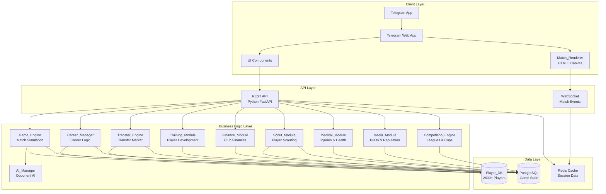

# Design Document: Telegram Football Manager

## Overview

Telegram Football Manager (TFM) is a simplified 2D Football Manager game running as a Telegram Web App. The system enables players to manage a football club through a complete career mode, handling squad management, tactics, transfers, training, and real-time 2D match visualization.

**Core Architecture:**
- **Backend**: Python 3.11 server handling game logic, match simulation, and data persistence
- **Frontend**: HTML5 Canvas + JavaScript for 2D match rendering and UI
- **Platform**: Telegram Web App accessible via Telegram Bot
- **Database**: Complete player database loaded from `2600球员属性.csv` (2600+ players with full attributes)

**Key Design Principles:**
1. **Performance**: Match simulation < 2 seconds server-side, 30+ FPS client-side rendering
2. **Scalability**: Support for full player database with efficient search and filtering
3. **Responsiveness**: Mobile-first design with touch-friendly controls
4. **Persistence**: Auto-save system with server-side storage linked to Telegram user ID
5. **Modularity**: Clear separation between game engine, rendering, and business logic modules

---

## Architecture

### System Architecture Diagram



### Technology Stack

**Backend:**
- **Language**: Python 3.11
- **Web Framework**: FastAPI (async REST API + WebSocket support)
- **Database**: PostgreSQL 15+ (relational data, JSONB for flexible schemas)
- **Cache**: Redis 7+ (session management, real-time match state)
- **ORM**: SQLAlchemy 2.0 (async support)
- **Task Queue**: Celery + Redis (background jobs: AI match simulation, weekly updates)
- **CSV Processing**: pandas (initial Player_DB load and validation)

**Frontend:**
- **Rendering**: HTML5 Canvas API (2D match visualization)
- **UI Framework**: Vanilla JavaScript + Telegram Web App SDK
- **State Management**: Custom lightweight state manager
- **Communication**: Fetch API (REST) + WebSocket API (real-time match events)
- **Build Tool**: Vite (fast development, optimized production builds)

**Infrastructure:**
- **Hosting**: Cloud platform (AWS/GCP/Azure) or VPS
- **Telegram Bot**: python-telegram-bot library
- **Monitoring**: Prometheus + Grafana (performance metrics)
- **Logging**: Structured logging with Python logging module

---

## Components and Interfaces

### 1. Game_Engine (Match Simulation Core)

**Responsibility**: Simulate 90-minute football matches in < 2 seconds, producing time-stamped event streams.

**Key Classes:**

```python
class MatchSimulator:
    """Core match simulation engine"""
    
    def simulate_match(
        self,
        home_team: Team,
        away_team: Team,
        tactics_home: TacticPreset,
        tactics_away: TacticPreset,
        weather: WeatherCondition,
        pitch_condition: PitchCondition
    ) -> MatchResult:
        """
        Simulate full 90-minute match.
        Returns: MatchResult with event stream, statistics, final score
        Processing time: < 2 seconds
        """
        pass
    
    def calculate_event_probability(
        self,
        attacking_team: Team,
        defending_team: Team,
        event_type: EventType,
        minute: int
    ) -> float:
        """
        Calculate probability of event (shot, tackle, pass, etc.)
        Factors: player CA, tactics, fatigue, morale, home advantage
        """
        pass
    
    def simulate_set_piece(
        self,
        team: Team,
        set_piece_type: SetPieceType,
        taker: Player
    ) -> SetPieceOutcome:
        """
        Dedicated set-piece logic (corners, free kicks, penalties)
        Uses player set-piece attributes
        """
        pass

class MatchEvent:
    """Single match event with timestamp"""
    minute: int
    second: int
    event_type: EventType  # PASS, SHOT, TACKLE, FOUL, GOAL, CARD, SUB
    team: TeamSide
    player_id: int
    target_player_id: Optional[int]
    position: Tuple[float, float]  # x, y coordinates on pitch
    success: bool
    metadata: Dict[str, Any]  # event-specific data

class MatchResult:
    """Complete match outcome"""
    home_score: int
    away_score: int
    events: List[MatchEvent]
    statistics: MatchStatistics
    player_ratings: Dict[int, float]  # player_id -> rating (1-10)
    injuries: List[InjuryEvent]
    cards: List[CardEvent]

```

**Match Simulation Algorithm:**

1. **Initialization** (minute 0):
   - Load team squads, tactics, player attributes from Player_DB
   - Apply home advantage (+5% effective CA to home team)
   - Initialize player stamina (100%), morale effects, weather modifiers

2. **Minute-by-Minute Loop** (minutes 1-90 + extra time):
   - **Possession Calculation**: Weighted by team CA, tactics (possession vs counter-attack), passing attributes
   - **Event Generation**: Roll for event type based on possession, tactics, player positions
     - Pass: 60-70% probability (varies by tactics)
     - Shot: 5-15% probability (higher for attacking tactics, near goal)
     - Tackle: 10-20% probability (higher for defensive tactics, pressing)
     - Foul: 2-5% probability (based on aggression, tackling attributes)
   - **Event Resolution**: Calculate success probability using relevant player attributes
     - Shot success: finishing, composure, technique vs goalkeeper attributes
     - Pass success: passing, vision, technique vs marking, positioning
     - Tackle success: tackling, positioning vs dribbling, agility
   - **Fatigue Update**: Reduce stamina based on work rate, pace, match intensity
     - If stamina < 50%: reduce effective CA by 10%
   - **Set Pieces**: Trigger on fouls in dangerous areas, corners from blocked shots

3. **Post-Match**:
   - Calculate player ratings (1-10) based on event success rate, key actions
   - Generate match statistics (possession %, shots, passes, tackles)
   - Simulate injuries (probability based on bravery, stamina, match intensity)
   - Persist MatchResult to database

**Performance Optimization:**
- Pre-calculate attribute-based probabilities at match start
- Use vectorized operations for batch event calculations
- Cache frequently accessed player data in Redis
- Limit event granularity (1 event per 5-10 seconds of match time)

---

### 2. Player_DB (Player Database Module)

**Responsibility**: Load, index, and query 2600+ players from CSV with full attribute profiles.

**Key Classes:**

```python
class PlayerDatabase:
    """Singleton managing complete player database"""
    
    def load_from_csv(self, csv_path: str) -> None:
        """
        Load 2600球员属性.csv into PostgreSQL
        - Parse CSV with pandas
        - Validate all 50+ attributes per player
        - Create full-text search indexes
        - Build club/league/nationality indexes
        """
        pass
    
    def search_players(
        self,
        query: str = None,
        filters: PlayerFilters = None,
        limit: int = 50,
        offset: int = 0
    ) -> List[Player]:
        """
        Full-text search across all players
        Filters: position, age range, CA range, PA range, nationality, club, league
        Returns: Paginated results with relevance scoring
        """
        pass
    
    def get_player_by_id(self, player_id: int) -> Player:
        """Retrieve single player with full attributes"""
        pass
    
    def get_players_by_club(self, club_id: int) -> List[Player]:
        """Get all players in a club (for squad management)"""
        pass

class Player:
    """Complete player model matching CSV schema"""
    # Identity
    uid: str
    name: str
    position: str  # e.g., "AM/ST RL"
    age: int
    nationality: str
    club: str
    
    # Core Attributes
    ca: int  # Current Ability (1-200)
    pa: int  # Potential Ability (1-200)
    
    # Technical Attributes (1-20 each)
    corners: int
    crossing: int
    dribbling: int
    finishing: int
    first_touch: int
    free_kicks: int
    heading: int
    long_shots: int
    long_throws: int
    marking: int
    passing: int
    penalty: int
    tackling: int
    technique: int
    
    # Mental Attributes (1-20 each)
    aggression: int
    anticipation: int
    bravery: int
    composure: int
    concentration: int
    decisions: int
    determination: int
    flair: int
    leadership: int
    off_the_ball: int
    positioning: int
    teamwork: int
    vision: int
    work_rate: int
    
    # Physical Attributes (1-20 each)
    acceleration: int
    agility: int
    balance: int
    jumping: int
    stamina: int
    pace: int
    endurance: int
    strength: int
    
    # Financial
    price: str  # Market value
    wage: int
    
    # Physical Stats
    height: int  # cm
    weight: int  # kg
    left_foot: int  # 1-20
    right_foot: int  # 1-20
    
    # Metadata
    traits: str  # Playing style traits (comma-separated)

```

**Player Search Implementation:**

```python
# PostgreSQL full-text search with GIN index
CREATE INDEX idx_player_search ON players USING GIN(
    to_tsvector('english', name || ' ' || position || ' ' || nationality || ' ' || club)
);

# Search query with filters
SELECT * FROM players
WHERE to_tsvector('english', name || ' ' || position || ' ' || nationality || ' ' || club) 
      @@ plainto_tsquery('english', :query)
  AND position LIKE :position_filter
  AND age BETWEEN :min_age AND :max_age
  AND ca BETWEEN :min_ca AND :max_ca
  AND pa BETWEEN :min_pa AND :max_pa
  AND nationality = :nationality_filter
  AND club = :club_filter
ORDER BY ts_rank(to_tsvector('english', name), plainto_tsquery('english', :query)) DESC
LIMIT :limit OFFSET :offset;
```

---

### 3. Transfer_Engine (Transfer Market Module)

**Responsibility**: Handle player transfers, loan deals, contract negotiations, and AI transfer activity.

**Key Classes:**

```python
class TransferEngine:
    """Manages all transfer operations"""
    
    def make_transfer_bid(
        self,
        buying_club_id: int,
        player_id: int,
        bid_amount: int,
        wage_offer: int,
        contract_length: int
    ) -> TransferBidResult:
        """
        Submit transfer bid for player
        - Check transfer window status
        - Validate squad size limits (max 40)
        - Calculate AI acceptance probability
        - Deduct from transfer budget if accepted
        """
        pass
    
    def calculate_ai_acceptance(
        self,
        player: Player,
        bid_amount: int,
        selling_club: Club,
        buying_club: Club
    ) -> float:
        """
        AI acceptance probability based on:
        - Bid vs market value ratio
        - Selling club financial situation
        - Player contract length remaining
        - Club reputation difference
        - Player morale and squad status
        """
        pass
    
    def process_loan_deal(
        self,
        loaning_club_id: int,
        player_id: int,
        loan_type: LoanType,  # SEASON_LONG, EMERGENCY
        wage_contribution: float  # 0.0-1.0
    ) -> LoanDealResult:
        """Handle loan transfers"""
        pass
    
    def generate_ai_bids(self, club_id: int) -> List[TransferBid]:
        """
        AI generates bids for player's listed players
        Based on: player value, AI club needs, budget
        """
        pass

class TransferWindow:
    """Transfer window state management"""
    is_open: bool
    window_type: WindowType  # SUMMER, WINTER
    opens_at: datetime
    closes_at: datetime
    
    def check_window_status(self, current_week: int) -> bool:
        """
        Summer window: weeks 1-8
        Winter window: weeks 26-30
        """
        pass

```

**Transfer AI Algorithm:**

```python
def calculate_ai_acceptance(player, bid_amount, selling_club, buying_club):
    """
    Returns probability 0.0-1.0
    """
    base_probability = 0.0
    
    # 1. Bid vs Market Value
    value_ratio = bid_amount / player.market_value
    if value_ratio >= 1.5:
        base_probability += 0.6
    elif value_ratio >= 1.2:
        base_probability += 0.4
    elif value_ratio >= 1.0:
        base_probability += 0.2
    elif value_ratio >= 0.8:
        base_probability += 0.1
    else:
        return 0.0  # Reject lowball offers
    
    # 2. Selling Club Financial Situation
    if selling_club.balance < 0:
        base_probability += 0.2  # Desperate to sell
    elif selling_club.balance < selling_club.wage_bill * 4:
        base_probability += 0.1  # Needs cash
    
    # 3. Player Contract Length
    months_remaining = player.contract_months_remaining
    if months_remaining <= 6:
        base_probability += 0.3  # Avoid losing on free
    elif months_remaining <= 12:
        base_probability += 0.15
    
    # 4. Player Squad Status
    if player.squad_status == "NOT_NEEDED":
        base_probability += 0.2
    elif player.squad_status == "BACKUP":
        base_probability += 0.1
    elif player.squad_status == "KEY_PLAYER":
        base_probability -= 0.2  # Reluctant to sell
    
    # 5. Club Reputation Difference
    rep_diff = buying_club.reputation - selling_club.reputation
    if rep_diff > 20:
        base_probability += 0.1  # Step up for player
    elif rep_diff < -20:
        base_probability -= 0.1  # Step down
    
    # 6. Player Morale
    if player.morale < 30:
        base_probability += 0.15  # Wants to leave
    
    return min(1.0, max(0.0, base_probability))
```

---

### 4. Career_Manager (Career Mode Module)

**Responsibility**: Manage single-club career progression, squad management, contracts, and manager attributes.

**Key Classes:**

```python
class CareerManager:
    """Core career mode logic"""
    
    def initialize_career(
        self,
        user_id: int,
        manager_name: str,
        selected_club_id: int
    ) -> Career:
        """
        Start new career:
        - Create manager profile
        - Assign to club
        - Load club squad from Player_DB
        - Set initial board objectives
        """
        pass
    
    def advance_week(self, career_id: int) -> WeekSummary:
        """
        Progress career by 1 week:
        - Process scheduled matches
        - Update player training
        - Age players on birthdays
        - Update finances
        - Check contract expirations
        - Generate events (injuries, media, board messages)
        """
        pass
    
    def manage_player_contract(
        self,
        career_id: int,
        player_id: int,
        action: ContractAction  # RENEW, RELEASE, NEGOTIATE
    ) -> ContractResult:
        """Handle player contract operations"""
        pass
    
    def set_squad_status(
        self,
        career_id: int,
        player_id: int,
        status: SquadStatus  # KEY_PLAYER, FIRST_TEAM, ROTATION, BACKUP, NOT_NEEDED
    ) -> None:
        """Update player squad status (affects morale)"""
        pass
    
    def interact_with_player(
        self,
        career_id: int,
        player_id: int,
        interaction: PlayerInteraction  # PRAISE, CRITICISE, PROMISE_TIME, DISCUSS_CONTRACT
    ) -> InteractionResult:
        """Player interaction affecting morale"""
        pass

class Manager:
    """Manager profile"""
    user_id: int
    name: str
    reputation: int  # 1-100
    
    # Manager Attributes (1-20 each)
    tactical_knowledge: int
    man_management: int
    motivating: int
    attacking: int
    defending: int
    technical: int
    mental: int
    youth_development: int
    board_relations: int
    
    # Career Stats
    seasons_managed: int
    trophies_won: int
    matches_won: int
    matches_drawn: int
    matches_lost: int
    total_transfer_spend: int

class Career:
    """Active career save"""
    id: int
    manager_id: int
    club_id: int
    current_season: int
    current_week: int  # 1-52
    board_confidence: int  # 1-100
    objectives: List[BoardObjective]
    save_timestamp: datetime

```

---

### 5. Match_Renderer (Client-Side 2D Visualization)

**Responsibility**: Render match events in real-time 2D animation on HTML5 Canvas at 30+ FPS.

**Key Components:**

```javascript
class MatchRenderer {
    constructor(canvasElement, matchEvents) {
        this.canvas = canvasElement;
        this.ctx = canvasElement.getContext('2d');
        this.events = matchEvents;
        this.currentEventIndex = 0;
        this.playbackSpeed = 1; // 1x, 2x, 4x, instant
        this.isPaused = false;
        
        // Pitch dimensions (scaled to canvas)
        this.pitchWidth = 105; // meters
        this.pitchHeight = 68; // meters
        this.scale = this.calculateScale();
        
        // Player/ball state
        this.players = new Map(); // player_id -> {x, y, team, number}
        this.ball = {x: 52.5, y: 34}; // center of pitch
    }
    
    calculateScale() {
        // Scale pitch to fit canvas while maintaining aspect ratio
        const widthScale = this.canvas.width / this.pitchWidth;
        const heightScale = this.canvas.height / this.pitchHeight;
        return Math.min(widthScale, heightScale) * 0.9; // 90% to leave margins
    }
    
    start() {
        // Begin animation loop
        this.animationFrame = requestAnimationFrame(() => this.render());
    }
    
    render() {
        // Clear canvas
        this.ctx.clearRect(0, 0, this.canvas.width, this.canvas.height);
        
        // Draw pitch
        this.drawPitch();
        
        // Draw players
        this.drawPlayers();
        
        // Draw ball
        this.drawBall();
        
        // Draw UI overlay (score, time, events)
        this.drawOverlay();
        
        // Process next event if not paused
        if (!this.isPaused) {
            this.processNextEvent();
        }
        
        // Continue loop
        this.animationFrame = requestAnimationFrame(() => this.render());
    }
    
    processNextEvent() {
        if (this.currentEventIndex >= this.events.length) {
            this.onMatchComplete();
            return;
        }
        
        const event = this.events[this.currentEventIndex];
        
        // Animate event based on type
        switch (event.event_type) {
            case 'PASS':
                this.animatePass(event);
                break;
            case 'SHOT':
                this.animateShot(event);
                break;
            case 'GOAL':
                this.animateGoal(event);
                break;
            case 'TACKLE':
                this.animateTackle(event);
                break;
            // ... other event types
        }
        
        this.currentEventIndex++;
    }
    
    drawPitch() {
        // Draw green pitch background
        this.ctx.fillStyle = '#2d5016';
        this.ctx.fillRect(0, 0, this.canvas.width, this.canvas.height);
        
        // Draw pitch markings (center circle, penalty boxes, goals, etc.)
        this.ctx.strokeStyle = '#ffffff';
        this.ctx.lineWidth = 2;
        
        // Center line
        const centerX = this.canvas.width / 2;
        this.ctx.beginPath();
        this.ctx.moveTo(centerX, 0);
        this.ctx.lineTo(centerX, this.canvas.height);
        this.ctx.stroke();
        
        // Center circle
        const centerY = this.canvas.height / 2;
        this.ctx.beginPath();
        this.ctx.arc(centerX, centerY, 9.15 * this.scale, 0, Math.PI * 2);
        this.ctx.stroke();
        
        // Penalty boxes, goals, etc.
        // ... (detailed pitch markings)
    }
    
    drawPlayers() {
        this.players.forEach((player, playerId) => {
            const x = player.x * this.scale;
            const y = player.y * this.scale;
            
            // Draw player circle
            this.ctx.fillStyle = player.team === 'HOME' ? '#ff0000' : '#0000ff';
            this.ctx.beginPath();
            this.ctx.arc(x, y, 8, 0, Math.PI * 2);
            this.ctx.fill();
            
            // Draw shirt number
            this.ctx.fillStyle = '#ffffff';
            this.ctx.font = '10px Arial';
            this.ctx.textAlign = 'center';
            this.ctx.textBaseline = 'middle';
            this.ctx.fillText(player.number, x, y);
        });
    }
    
    drawBall() {
        const x = this.ball.x * this.scale;
        const y = this.ball.y * this.scale;
        
        this.ctx.fillStyle = '#ffffff';
        this.ctx.beginPath();
        this.ctx.arc(x, y, 4, 0, Math.PI * 2);
        this.ctx.fill();
        
        this.ctx.strokeStyle = '#000000';
        this.ctx.lineWidth = 1;
        this.ctx.stroke();
    }
    
    animatePass(event) {
        // Animate ball movement from player to target
        // Use easing function for smooth motion
        // Duration: 0.5-2 seconds depending on distance
    }
    
    animateGoal(event) {
        // Show goal celebration animation
        // Flash score, zoom on goal, confetti effect
        // Duration: 3 seconds max
    }
}
```

**Performance Optimizations:**
- Use `requestAnimationFrame` for smooth 60 FPS rendering
- Implement object pooling for player/ball sprites
- Use canvas layers (separate canvas for static pitch, dynamic players)
- Throttle event processing based on playback speed
- Implement viewport culling (only render visible area)

---

## Data Models

### Database Schema

```mermaid
erDiagram
    USERS ||--o{ CAREERS : has
    CAREERS ||--|| CLUBS : manages
    CAREERS ||--o{ SAVES : has
    CLUBS ||--o{ SQUAD_PLAYERS : contains
    CLUBS ||--o{ STAFF : employs
    CLUBS ||--|| FINANCES : has
    CLUBS ||--|| INFRASTRUCTURE : has
    SQUAD_PLAYERS }o--|| PLAYERS : references
    SQUAD_PLAYERS ||--o{ PLAYER_CONTRACTS : has
    SQUAD_PLAYERS ||--o{ INJURIES : suffers
    CAREERS ||--o{ MATCHES : plays
    MATCHES ||--o{ MATCH_EVENTS : contains
    MATCHES ||--o{ MATCH_STATISTICS : generates
    CAREERS ||--o{ TRANSFERS : executes
    CAREERS ||--o{ TRAINING_SCHEDULES : has
    CAREERS ||--o{ SCOUTING_ASSIGNMENTS : has
    CAREERS ||--o{ MEDIA_EVENTS : experiences
    COMPETITIONS ||--o{ FIXTURES : contains
    FIXTURES ||--o{ MATCHES : schedules
