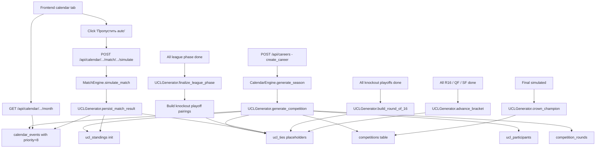
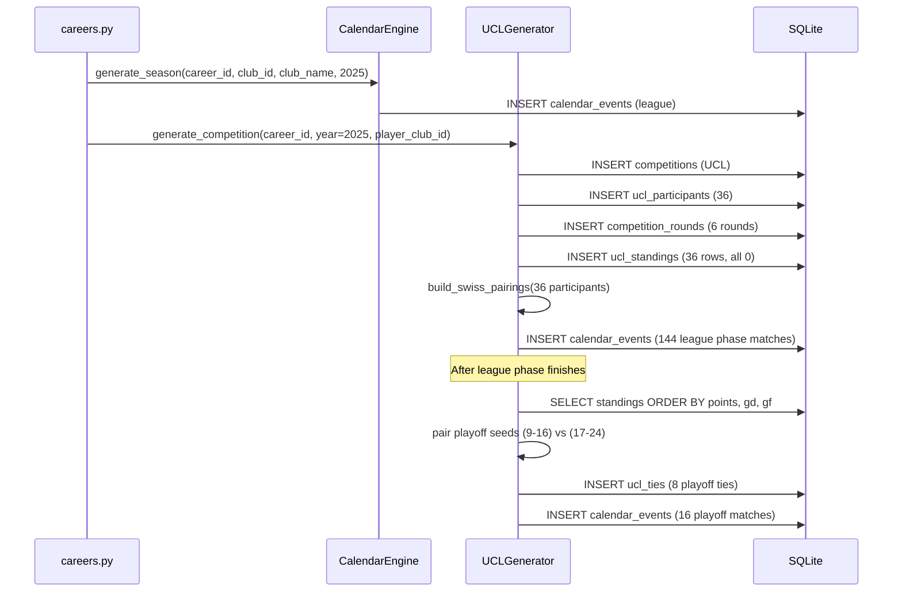

# Design Document: UEFA Champions League

## Overview

The UEFA Champions League module simulates the modern (2024/25+) European club competition format inside the FM26 game. On career creation, the `UCLGenerator` service registers 36 participating clubs, generates an 8-matchday Swiss-system league phase schedule, sets up the knockout playoff and main bracket templates, and inserts every UCL match into the existing `calendar_events` table so the existing calendar tab renders them with no frontend changes. Match simulation is delegated entirely to the existing `MatchEngine` (CA-driven, with home advantage). The new service tracks standings, two-legged aggregate scores, and bracket progression in four new tables, persisted via an Alembic migration.

The architecture follows the existing project pattern: a FastAPI backend with async SQLAlchemy services, raw SQL for SQLite compatibility (mirroring `CalendarEngine`), and integration with the existing `frontend/index.html` calendar tab through the already-implemented `POST /api/calendar/{career_id}/match/{event_id}/simulate` endpoint.

---

## Architecture

### High-Level Data Flow



### Component Interaction



### Module Layout

```
app/
├── models/
│   ├── ucl_participant.py        # UCLParticipant ORM model (new)
│   ├── ucl_standing.py           # UCLStanding ORM model (new)
│   ├── ucl_tie.py                # UCLTie ORM model (new)
│   └── competition_round.py      # CompetitionRound ORM model (new)
├── services/
│   └── ucl_generator.py          # Swiss pairings, bracket, schedule, results (new)
├── data/
│   └── ucl_config.py             # UCL_PARTICIPANTS list, dates, venue (new)
├── api/routes/
│   └── calendar.py               # Existing simulate endpoint — extend to UCL persistence
└── api/routes/
    └── careers.py                # Existing create_career — invoke UCLGenerator
alembic/
└── versions/
    └── 20260520_*-add_ucl_tables.py  # Migration for 4 new tables
```

---

## Components and Interfaces

### 1. UCLGenerator (`app/services/ucl_generator.py`)

The central orchestrator for the entire UCL competition lifecycle.

```python
class UCLScheduleError(Exception):
    """Raised when the Swiss-system pairing algorithm cannot satisfy constraints."""


class UCLGenerator:
    """
    Generates and manages the UEFA Champions League competition for a career.
    """

    def __init__(self, session: AsyncSession, rng: Optional[random.Random] = None):
        self.session = session
        self.rng = rng or random.Random()

    # --- Top-level lifecycle ---

    async def generate_competition(
        self,
        career_id: int,
        year: int,
        player_club_id: Optional[int],
    ) -> int:
        """
        Generate a full UCL season for a career.

        Steps:
          1. Insert competitions row (continental_cup, name='Champions League').
          2. Insert ucl_participants (36) using UCL_PARTICIPANTS from app.data.ucl_config.
          3. Insert competition_rounds (league_phase, knockout_playoff,
             round_of_16, quarter_final, semi_final, final).
          4. Initialise ucl_standings (36 rows, all zero).
          5. build_swiss_pairings() and assign 8 matchdays to Tue/Wed dates
             (Sept-Jan), skipping FIFA international windows and dates with
             priority>=10 calendar events for the player's club.
          6. Insert 144 calendar_events for the league phase with
             priority=8, kick_off_time='21:00', and Russian/English
             descriptions per Requirements 7.4 and 7.5.
          7. Insert 8 placeholder ucl_ties for the knockout playoff round
             (winner_participant_id=NULL, scores=NULL).
          8. Insert 8 placeholder ucl_ties for round_of_16 (with
             bracket_position 1-8) and 4 for quarter_final, 2 for semi_final.
          9. Insert 1 placeholder calendar_event for the final on
             UCL_FINAL_DATE with the neutral venue in the description.

        Returns the new competition_id.
        Idempotent: returns existing competition_id if already generated for
        this career_id+year.
        """

    # --- League phase scheduling ---

    def build_swiss_pairings(
        self,
        participants: List[Participant],
    ) -> List[List[Tuple[int, int]]]:
        """
        Generate Swiss-system pairings: 36 participants × 8 matches each
        (4 home, 4 away, 8 distinct opponents per club, 18 matches per matchday).

        Algorithm (simplified — UEFA uses pot-based draw; we approximate):
          1. Split 36 participants into 4 pots of 9 by seed (UEFA coefficient
             approximation = club_id-derived rank).
          2. For each participant, draw 2 opponents from each of the 4 pots,
             ensuring 1 home and 1 away per pot, no duplicate opponents.
          3. Use a graph-coloring/round-robin-style algorithm to assign
             each pairing to one of the 8 matchdays such that no participant
             plays twice on the same matchday.
          4. Validate: each participant has exactly 4 home and 4 away
             matches, and 8 distinct opponents.

        Returns 8 matchdays, each a list of (home_participant_id, away_participant_id).
        Raises UCLScheduleError if constraints cannot be satisfied (rare;
        retry with different seed should succeed).
        """

    def assign_matchdays_to_dates(
        self,
        matchdays: List[List[Tuple[int, int]]],
        year: int,
        blocked_ranges: List[Tuple[date, date]],
    ) -> List[date]:
        """
        Assign each of the 8 league phase matchdays to a Tuesday or Wednesday
        between September and end of January, skipping blocked_ranges
        (FIFA windows, mandatory holiday fixtures).

        Default schedule (target dates, with ±2-day flexibility):
          Matchday 1: 3rd Tuesday of September
          Matchday 2: 1st Wednesday of October
          Matchday 3: 3rd Tuesday of October
          Matchday 4: 1st Wednesday of November
          Matchday 5: 4th Tuesday of November
          Matchday 6: 2nd Wednesday of December
          Matchday 7: 3rd Tuesday of January
          Matchday 8: last Wednesday of January

        Returns the 8 assigned dates in order.
        """

    # --- Standings ---

    async def update_standing(
        self,
        competition_id: int,
        home_participant_id: int,
        away_participant_id: int,
        home_score: int,
        away_score: int,
    ) -> None:
        """
        Update the ucl_standings rows of both participants after a league
        phase match. Adds played +1, increments won/drawn/lost,
        adds goals_for/goals_against, recomputes goal_difference and points.
        Recomputes ranks 1-36 across all 36 standings rows.
        """

    async def get_league_phase_table(
        self,
        competition_id: int,
    ) -> List[StandingRow]:
        """
        Return the 36-row standings table sorted by:
          (1) points DESC
          (2) goal_difference DESC
          (3) goals_for DESC
          (4) participant.club_name ASC
        """

    # --- Knockout phase ---

    async def finalize_league_phase(self, competition_id: int) -> None:
        """
        Called when all 144 league phase matches have results.
        Steps:
          1. Recompute final ranks 1-36.
          2. Mark league_phase round as completed.
          3. Generate 8 knockout_playoff pairings (rank 9-16 × rank 17-24).
          4. Update the 8 placeholder ucl_ties for knockout_playoff with
             home_participant_id and away_participant_id.
          5. Schedule first leg + second leg calendar_events.
          6. Mark eliminated participants (ranks 25-36).
        """

    async def build_round_of_16(self, competition_id: int) -> None:
        """
        Called when all 8 knockout_playoff ties are decided.
        Pairs ranks 1-8 with the 8 playoff winners according to
        UCL_R16_BRACKET_MAP (e.g. seed 1 vs lowest playoff winner).
        Updates the 8 placeholder ucl_ties for round_of_16.
        Schedules first leg + second leg calendar_events.
        """

    async def advance_bracket(
        self,
        competition_id: int,
        from_round: str,
    ) -> None:
        """
        Generic bracket-advancing function. Called when all ties of the
        given round are decided. Pairs winners according to bracket_position
        and updates the placeholder ucl_ties of the next round.
        from_round: 'round_of_16' -> 'quarter_final',
                    'quarter_final' -> 'semi_final',
                    'semi_final' -> 'final'.
        """

    async def crown_champion(
        self,
        competition_id: int,
        winner_participant_id: int,
    ) -> None:
        """
        Mark the competition as completed and store the champion.
        """

    # --- Match result handling (called by simulate endpoint) ---

    async def persist_match_result(
        self,
        competition_id: int,
        calendar_event_id: int,
        home_participant_id: int,
        away_participant_id: int,
        home_score: int,
        away_score: int,
        round_type: str,
        leg: Optional[int],  # 1 or 2 for two-legged ties; None for league/final
    ) -> Optional[int]:
        """
        Persist a UCL match result.

        For league_phase: calls update_standing.
        For knockout rounds: updates the corresponding ucl_ties row's
        leg1/leg2 scores, recomputes aggregate_home/aggregate_away, and if
        both legs are played, determines the winner per Requirements 5.4-5.5
        (extra time and penalties simulated by sampling additional events
        from MatchEngine if Aggregate_Score is tied).
        Returns the winner_participant_id when a tie is decided, else None.
        """

    # --- Helpers ---

    def _build_event_description(
        self,
        round_type: str,
        matchday: Optional[int],
        leg: Optional[int],
        player_club_id: Optional[int],
        home_club_name: str,
        away_club_name: str,
        is_player_home: Optional[bool],
        opponent_name: Optional[str],
        neutral_venue: Optional[str] = None,
    ) -> str:
        """
        Build the description string per Requirements 7.4, 7.5, 7.6.
        For matches involving the player's club, format is:
          'Лига чемпионов, {round_label}: vs {opponent_name} (H|A)'
        For other matches:
          'Champions League {round_label}: {home} vs {away}'
        For the final:
          'Лига чемпионов, финал: {a} vs {b} ({neutral_venue})'
        """
```

### 2. Static UCL Configuration (`app/data/ucl_config.py`)

```python
from datetime import date

# 36 UCL participants (2024/25+ format).
# Each entry: (display_name, club_id_or_None, country)
# club_id is the 1-based index in CLUBS from app.data.club_budgets,
# or None if the club is not present in CLUBS.
UCL_PARTICIPANTS: list[tuple[str, int | None, str]] = [
    # England (6)
    ("Arsenal", 3, "England"),
    ("Liverpool", 2, "England"),
    ("Manchester City", 1, "England"),
    ("Newcastle United", 6, "England"),
    ("Tottenham Hotspur", 7, "England"),
    ("Chelsea", 4, "England"),
    # Spain (5)
    ("Athletic Bilbao", 25, "Spain"),
    ("A. Madrid", 23, "Spain"),
    ("Barcelona", 22, "Spain"),
    ("Villarreal", 26, "Spain"),
    ("R. Madrid", 21, "Spain"),
    # Germany (4)
    ("Bayern Munich", 41, "Germany"),
    ("Bayer Leverkusen", 44, "Germany"),
    ("Borussia Dortmund", 43, "Germany"),
    ("Eintracht Frankfurt", 46, "Germany"),
    # Italy (4)
    ("Atalanta", 63, "Italy"),
    ("Inter Milan", 60, "Italy"),
    ("Juventus", 59, "Italy"),
    ("Napoli", 62, "Italy"),
    # France (3)
    ("Marseille", 81, "France"),
    ("Monaco", 80, "France"),
    ("Paris Saint-Germain", 79, "France"),
    # Netherlands (2)
    ("Ajax", 117, "Netherlands"),
    ("PSV Eindhoven", 118, "Netherlands"),
    # Portugal (2)
    ("Benfica", 99, "Portugal"),
    ("Sporting CP", 100, "Portugal"),
    # Belgium (2): not in CLUBS — string-only participants
    ("Club Brugge", None, "Belgium"),
    ("Union Saint-Gilloise", None, "Belgium"),
    # Other 8: not in CLUBS — string-only participants
    ("Bodø/Glimt", None, "Norway"),
    ("Galatasaray", 137, "Turkey"),
    ("Kairat", None, "Kazakhstan"),
    ("Qarabağ", None, "Azerbaijan"),
    ("Copenhagen", None, "Denmark"),
    ("Olympiacos", None, "Greece"),
    ("Pafos", None, "Cyprus"),
    ("Slavia Prague", None, "Czech Republic"),
]

assert len(UCL_PARTICIPANTS) == 36

# League phase target matchday dates (will be year-shifted by UCLGenerator).
# Each tuple: (month, week_of_month, weekday)
# weekday: 1=Tuesday, 2=Wednesday
UCL_LEAGUE_PHASE_TARGETS = [
    (9, 3, 1),   # MD1: 3rd Tuesday of September
    (10, 1, 2),  # MD2: 1st Wednesday of October
    (10, 3, 1),  # MD3: 3rd Tuesday of October
    (11, 1, 2),  # MD4: 1st Wednesday of November
    (11, 4, 1),  # MD5: 4th Tuesday of November
    (12, 2, 2),  # MD6: 2nd Wednesday of December
    (1, 3, 1),   # MD7: 3rd Tuesday of January (next year)
    (1, 5, 2),   # MD8: last Wednesday of January (next year)
]

# Knockout playoff first/second leg target offsets in days (from a base
# date in mid-February of the next calendar year).
UCL_KO_PLAYOFF_BASE_MONTH = 2  # February
UCL_KO_PLAYOFF_LEG_GAP_DAYS = 7

# Round of 16, QF, SF target windows.
UCL_R16_LEG1_MONTH = 3   # early March
UCL_QF_LEG1_MONTH = 4    # early April
UCL_SF_LEG1_MONTH = 4    # late April / early May

# Final fixed venue and date.
UCL_FINAL_VENUE = "Puskás Aréna, Budapest"
# Default: last Saturday of May. Helper computes actual date per year.

def get_final_date(year: int) -> date:
    """Return last Saturday of May in the given year."""
    d = date(year, 5, 31)
    while d.weekday() != 5:  # 5 = Saturday
        d = date(year, 5, d.day - 1)
    return d

# Bracket map for Round of 16.
# Maps (seed of direct qualifier 1-8, seed of playoff winner index 1-8)
# such that higher seed plays second leg at home.
# Standard pairing: 1v8, 2v7, 3v6, 4v5 of playoff winners.
UCL_R16_BRACKET_MAP = {
    1: 8,  # seed 1 plays lowest-ranked playoff winner
    2: 7,
    3: 6,
    4: 5,
    5: 4,
    6: 3,
    7: 2,
    8: 1,
}
```

### 3. Calendar API Route Extension (`app/api/routes/calendar.py`)

The existing `POST /api/calendar/{career_id}/match/{event_id}/simulate` already parses the opponent from the description and runs `MatchEngine.simulate_match`. The extension is a small post-simulation hook:

```python
# Inside simulate_match_event(), AFTER MatchEngine returns result,
# AND AFTER the description is updated, add:

# Detect UCL competition events and persist UCL state.
if row[3] is not None or row[4] is not None:  # has competition_id
    comp_id = await db.execute(
        text("SELECT competition_id FROM calendar_events WHERE id = :eid"),
        {"eid": event_id},
    )
    competition_id = comp_id.scalar()
    if competition_id is not None:
        # Look up if this is a UCL match
        ucl_check = await db.execute(
            text("SELECT competition_type FROM competitions WHERE id = :cid"),
            {"cid": competition_id},
        )
        if (ucl_check.scalar() or "").lower().endswith("continental_cup"):
            from app.services.ucl_generator import UCLGenerator
            generator = UCLGenerator(db)
            await generator.persist_match_result(
                competition_id=competition_id,
                calendar_event_id=event_id,
                home_participant_id=...,  # resolved from event home_club_id + competition_id
                away_participant_id=...,
                home_score=match_result.home_score,
                away_score=match_result.away_score,
                round_type=...,  # determined from the event description
                leg=...,
            )
```

The key insight: the existing simulate endpoint *already* parses opponent name from `description` containing `"vs OpponentName (H)"` or `"(A)"`. The UCL generator follows the *same* description format so this endpoint requires only an additive extension — no changes to its existing parsing logic.

### 4. Career Creation Hook (`app/api/routes/careers.py`)

After `CalendarEngine.generate_season(...)` succeeds, add:

```python
# Auto-generate UCL competition
try:
    from app.services.ucl_generator import UCLGenerator
    ucl = UCLGenerator(db)
    await ucl.generate_competition(career_id, year=2025, player_club_id=request.club_id)
    print(f"  UCL competition generated for career {career_id}")
except Exception as e:
    print(f"  UCL generation warning: {e}")
```

This mirrors the existing try/except wrapping around `CalendarEngine.generate_season` (lines 193-200 of the current `careers.py`), satisfying Requirement 10.2.

### 5. Frontend (no UCL-specific code)

The existing day-detail panel rendering (`onDayClick` in `frontend/index.html`) already injects the two action buttons for *every* `event.event_type === 'match'`. Because UCL calendar events use the same `event_type='match'`, no frontend changes are required (Requirement 11.1). The `▶ Играть матч` button already shows the alert `'Движок в разработке, попробуйте через несколько дней'` (Requirement 11.4). The `⏭ Пропустить (авто)` button already calls `simulateMatchEvent(ev.id)` which posts to the simulate endpoint and renders the result via `showMatchResult(data)` (Requirement 11.3).

---

## Data Models

### CompetitionRound (`app/models/competition_round.py`)

```python
class CompetitionRound(Base):
    __tablename__ = "competition_rounds"

    id: Mapped[int] = mapped_column(primary_key=True, autoincrement=True)
    competition_id: Mapped[int] = mapped_column(
        Integer, ForeignKey("competitions.id", ondelete="CASCADE"),
        nullable=False, index=True,
    )
    round_type: Mapped[str] = mapped_column(String(30), nullable=False)
    # Values: league_phase, knockout_playoff, round_of_16,
    #         quarter_final, semi_final, final
    round_order: Mapped[int] = mapped_column(Integer, nullable=False)
    start_date: Mapped[Optional[date]] = mapped_column(Date, nullable=True)
    end_date: Mapped[Optional[date]] = mapped_column(Date, nullable=True)
    is_completed: Mapped[bool] = mapped_column(Boolean, default=False)

    created_at: Mapped[datetime] = mapped_column(DateTime, server_default=func.now())

    __table_args__ = (
        Index('idx_comp_rounds_comp', 'competition_id'),
        Index('idx_comp_rounds_comp_order', 'competition_id', 'round_order', unique=True),
    )
```

### UCLParticipant (`app/models/ucl_participant.py`)

```python
class UCLParticipant(Base):
    __tablename__ = "ucl_participants"

    id: Mapped[int] = mapped_column(primary_key=True, autoincrement=True)
    competition_id: Mapped[int] = mapped_column(
        Integer, ForeignKey("competitions.id", ondelete="CASCADE"),
        nullable=False, index=True,
    )
    club_id: Mapped[Optional[int]] = mapped_column(Integer, nullable=True)
    # club_id is the 1-based CLUBS index, or NULL for clubs not in CLUBS.
    club_name: Mapped[str] = mapped_column(String(100), nullable=False)
    country: Mapped[str] = mapped_column(String(50), nullable=False)
    seed: Mapped[int] = mapped_column(Integer, nullable=False)
    # seed: 1-36, used for Swiss-system pot draw and bracket pairing.
    final_rank: Mapped[Optional[int]] = mapped_column(Integer, nullable=True)
    # final_rank: 1-36 after league phase ends.

    __table_args__ = (
        Index('idx_ucl_part_comp', 'competition_id'),
        Index('idx_ucl_part_comp_seed', 'competition_id', 'seed', unique=True),
    )
```

### UCLStanding (`app/models/ucl_standing.py`)

```python
class UCLStanding(Base):
    __tablename__ = "ucl_standings"

    id: Mapped[int] = mapped_column(primary_key=True, autoincrement=True)
    competition_id: Mapped[int] = mapped_column(
        Integer, ForeignKey("competitions.id", ondelete="CASCADE"),
        nullable=False, index=True,
    )
    participant_id: Mapped[int] = mapped_column(
        Integer, ForeignKey("ucl_participants.id", ondelete="CASCADE"),
        nullable=False, index=True,
    )
    played: Mapped[int] = mapped_column(Integer, default=0, nullable=False)
    won: Mapped[int] = mapped_column(Integer, default=0, nullable=False)
    drawn: Mapped[int] = mapped_column(Integer, default=0, nullable=False)
    lost: Mapped[int] = mapped_column(Integer, default=0, nullable=False)
    goals_for: Mapped[int] = mapped_column(Integer, default=0, nullable=False)
    goals_against: Mapped[int] = mapped_column(Integer, default=0, nullable=False)
    goal_difference: Mapped[int] = mapped_column(Integer, default=0, nullable=False)
    points: Mapped[int] = mapped_column(Integer, default=0, nullable=False)
    rank: Mapped[Optional[int]] = mapped_column(Integer, nullable=True)

    __table_args__ = (
        Index('idx_ucl_stand_comp', 'competition_id'),
        Index('idx_ucl_stand_comp_part', 'competition_id', 'participant_id', unique=True),
    )
```

### UCLTie (`app/models/ucl_tie.py`)

```python
class UCLTie(Base):
    __tablename__ = "ucl_ties"

    id: Mapped[int] = mapped_column(primary_key=True, autoincrement=True)
    competition_id: Mapped[int] = mapped_column(
        Integer, ForeignKey("competitions.id", ondelete="CASCADE"),
        nullable=False, index=True,
    )
    round_id: Mapped[int] = mapped_column(
        Integer, ForeignKey("competition_rounds.id", ondelete="CASCADE"),
        nullable=False, index=True,
    )
    home_participant_id: Mapped[Optional[int]] = mapped_column(
        Integer, ForeignKey("ucl_participants.id"), nullable=True,
    )
    # The "home" participant plays first leg at home; placeholder when round
    # has not yet been seeded.
    away_participant_id: Mapped[Optional[int]] = mapped_column(
        Integer, ForeignKey("ucl_participants.id"), nullable=True,
    )

    leg1_home_score: Mapped[Optional[int]] = mapped_column(Integer, nullable=True)
    leg1_away_score: Mapped[Optional[int]] = mapped_column(Integer, nullable=True)
    leg2_home_score: Mapped[Optional[int]] = mapped_column(Integer, nullable=True)
    leg2_away_score: Mapped[Optional[int]] = mapped_column(Integer, nullable=True)
    # For two-legged ties, leg2 is played at home_participant's stadium —
    # i.e. the higher-seeded club plays the *second* leg at home.
    # leg2_home_score = higher-seed-at-home score on second leg.

    aggregate_home: Mapped[Optional[int]] = mapped_column(Integer, nullable=True)
    aggregate_away: Mapped[Optional[int]] = mapped_column(Integer, nullable=True)
    # aggregate_home = leg1_home_score + leg2_away_score
    # (because in leg2 the "home" participant is the away team)
    # aggregate_away = leg1_away_score + leg2_home_score

    winner_participant_id: Mapped[Optional[int]] = mapped_column(
        Integer, ForeignKey("ucl_participants.id"), nullable=True,
    )
    winner_decided_by: Mapped[Optional[str]] = mapped_column(String(20), nullable=True)
    # Values: aggregate, extra_time, penalties, single_match (final only)

    bracket_position: Mapped[int] = mapped_column(Integer, nullable=False)
    # bracket_position uniquely identifies a slot in the round so
    # advance_bracket() can pair winners deterministically.

    __table_args__ = (
        Index('idx_ucl_tie_comp', 'competition_id'),
        Index('idx_ucl_tie_round', 'round_id'),
        Index('idx_ucl_tie_round_pos', 'round_id', 'bracket_position', unique=True),
    )
```

### Supporting Dataclasses (in `ucl_generator.py`)

```python
@dataclass
class Participant:
    id: int                    # ucl_participants.id
    club_id: Optional[int]     # CLUBS 1-based index or None
    club_name: str
    country: str
    seed: int                  # 1-36

@dataclass
class StandingRow:
    participant_id: int
    club_name: str
    played: int
    won: int
    drawn: int
    lost: int
    goals_for: int
    goals_against: int
    goal_difference: int
    points: int
    rank: int

@dataclass
class TieResult:
    tie_id: int
    aggregate_home: int
    aggregate_away: int
    winner_participant_id: int
    winner_decided_by: str  # 'aggregate' | 'extra_time' | 'penalties'
```

### Database Migration (Alembic)

Create `alembic/versions/20260520_*-add_ucl_tables.py`:

```python
def upgrade():
    op.create_table(
        'competition_rounds',
        sa.Column('id', sa.Integer, primary_key=True, autoincrement=True),
        sa.Column('competition_id', sa.Integer,
                  sa.ForeignKey('competitions.id', ondelete='CASCADE'), nullable=False),
        sa.Column('round_type', sa.String(30), nullable=False),
        sa.Column('round_order', sa.Integer, nullable=False),
        sa.Column('start_date', sa.Date, nullable=True),
        sa.Column('end_date', sa.Date, nullable=True),
        sa.Column('is_completed', sa.Boolean, default=False, nullable=False),
        sa.Column('created_at', sa.DateTime, server_default=sa.func.now()),
    )
    op.create_index('idx_comp_rounds_comp', 'competition_rounds', ['competition_id'])
    op.create_index('idx_comp_rounds_comp_order', 'competition_rounds',
                    ['competition_id', 'round_order'], unique=True)

    op.create_table(
        'ucl_participants',
        sa.Column('id', sa.Integer, primary_key=True, autoincrement=True),
        sa.Column('competition_id', sa.Integer,
                  sa.ForeignKey('competitions.id', ondelete='CASCADE'), nullable=False),
        sa.Column('club_id', sa.Integer, nullable=True),
        sa.Column('club_name', sa.String(100), nullable=False),
        sa.Column('country', sa.String(50), nullable=False),
        sa.Column('seed', sa.Integer, nullable=False),
        sa.Column('final_rank', sa.Integer, nullable=True),
    )
    op.create_index('idx_ucl_part_comp', 'ucl_participants', ['competition_id'])
    op.create_index('idx_ucl_part_comp_seed', 'ucl_participants',
                    ['competition_id', 'seed'], unique=True)

    op.create_table(
        'ucl_standings',
        sa.Column('id', sa.Integer, primary_key=True, autoincrement=True),
        sa.Column('competition_id', sa.Integer,
                  sa.ForeignKey('competitions.id', ondelete='CASCADE'), nullable=False),
        sa.Column('participant_id', sa.Integer,
                  sa.ForeignKey('ucl_participants.id', ondelete='CASCADE'), nullable=False),
        sa.Column('played', sa.Integer, nullable=False, server_default='0'),
        sa.Column('won', sa.Integer, nullable=False, server_default='0'),
        sa.Column('drawn', sa.Integer, nullable=False, server_default='0'),
        sa.Column('lost', sa.Integer, nullable=False, server_default='0'),
        sa.Column('goals_for', sa.Integer, nullable=False, server_default='0'),
        sa.Column('goals_against', sa.Integer, nullable=False, server_default='0'),
        sa.Column('goal_difference', sa.Integer, nullable=False, server_default='0'),
        sa.Column('points', sa.Integer, nullable=False, server_default='0'),
        sa.Column('rank', sa.Integer, nullable=True),
    )
    op.create_index('idx_ucl_stand_comp', 'ucl_standings', ['competition_id'])
    op.create_index('idx_ucl_stand_comp_part', 'ucl_standings',
                    ['competition_id', 'participant_id'], unique=True)

    op.create_table(
        'ucl_ties',
        sa.Column('id', sa.Integer, primary_key=True, autoincrement=True),
        sa.Column('competition_id', sa.Integer,
                  sa.ForeignKey('competitions.id', ondelete='CASCADE'), nullable=False),
        sa.Column('round_id', sa.Integer,
                  sa.ForeignKey('competition_rounds.id', ondelete='CASCADE'), nullable=False),
        sa.Column('home_participant_id', sa.Integer,
                  sa.ForeignKey('ucl_participants.id'), nullable=True),
        sa.Column('away_participant_id', sa.Integer,
                  sa.ForeignKey('ucl_participants.id'), nullable=True),
        sa.Column('leg1_home_score', sa.Integer, nullable=True),
        sa.Column('leg1_away_score', sa.Integer, nullable=True),
        sa.Column('leg2_home_score', sa.Integer, nullable=True),
        sa.Column('leg2_away_score', sa.Integer, nullable=True),
        sa.Column('aggregate_home', sa.Integer, nullable=True),
        sa.Column('aggregate_away', sa.Integer, nullable=True),
        sa.Column('winner_participant_id', sa.Integer,
                  sa.ForeignKey('ucl_participants.id'), nullable=True),
        sa.Column('winner_decided_by', sa.String(20), nullable=True),
        sa.Column('bracket_position', sa.Integer, nullable=False),
    )
    op.create_index('idx_ucl_tie_comp', 'ucl_ties', ['competition_id'])
    op.create_index('idx_ucl_tie_round', 'ucl_ties', ['round_id'])
    op.create_index('idx_ucl_tie_round_pos', 'ucl_ties',
                    ['round_id', 'bracket_position'], unique=True)


def downgrade():
    op.drop_index('idx_ucl_tie_round_pos', table_name='ucl_ties')
    op.drop_table('ucl_ties')
    op.drop_index('idx_ucl_stand_comp_part', table_name='ucl_standings')
    op.drop_table('ucl_standings')
    op.drop_index('idx_ucl_part_comp_seed', table_name='ucl_participants')
    op.drop_table('ucl_participants')
    op.drop_index('idx_comp_rounds_comp_order', table_name='competition_rounds')
    op.drop_table('competition_rounds')
```

The `run_local.py` `create_tables()` function (used by the dev SQLite path) must mirror the same schema for local non-Alembic dev — see Tasks 1.1.

---


## Correctness Properties

*A property is a characteristic or behavior that should hold true across all valid executions of a system — essentially, a formal statement about what the system should do. Properties serve as the bridge between human-readable specifications and machine-verifiable correctness guarantees.*

### Property 1: Swiss-system pairing invariants

*For all* random seeds passed to `build_swiss_pairings(36 participants)`, the resulting league phase schedule SHALL satisfy: every participant has exactly 8 distinct opponents, exactly 4 home matches and 4 away matches, the total number of unique matches is 144, and each of the 8 matchdays contains exactly 18 matches with no participant appearing twice.

**Validates: Requirements 2.1, 2.2, 2.3, 2.4**

### Property 2: Schedule date constraints

*For all* random year inputs and any UCL competition generated for that year, every league phase calendar event date SHALL fall on a Tuesday or Wednesday between September 1 and January 31 of the following year, SHALL NOT fall within any FIFA international window from `FIFA_INTERNATIONAL_WINDOWS`, and no two UCL matches involving the same participant SHALL occur within 48 hours of each other. For knockout legs, both legs SHALL fall on a Tuesday or Wednesday and the second leg date SHALL be at least 7 days after the first.

**Validates: Requirements 2.5, 2.6, 2.7, 2.8, 5.2**

### Property 3: Standings consistency

*For all* sequences of league phase match results applied via `update_standing()`, the resulting `ucl_standings` table SHALL satisfy: (a) for every row, `goal_difference == goals_for - goals_against`; (b) for every row, `points == 3 * won + drawn` and `played == won + drawn + lost`; (c) the sum of `points` across all 36 rows equals `3 * total_decisive_matches + 2 * total_draws`; (d) when sorted by `(points DESC, goal_difference DESC, goals_for DESC, club_name ASC)`, ranks 1 through 36 form a bijection on the participants.

**Validates: Requirements 3.2, 3.3, 3.4, 3.5**

### Property 4: Qualifier classification by rank

*For any* completed league phase standings table sorted per Property 3, the set of direct Round of 16 qualifiers SHALL equal the participants at sorted positions 1 through 8, the set of knockout playoff participants SHALL equal positions 9 through 24, and the set of eliminated participants SHALL equal positions 25 through 36 — these three sets SHALL be pairwise disjoint and SHALL partition the 36 participants.

**Validates: Requirements 4.1, 4.2, 4.3**

### Property 5: Knockout bracket pairing invariants

*For any* completed league phase standings, the 8 generated knockout playoff ties SHALL each pair exactly one participant from rank range [9, 16] (high seed) with exactly one from rank range [17, 24] (low seed), and the high-seeded participant SHALL be stored as `home_participant_id` so it plays the second leg at home; furthermore the Round of 16 ties SHALL pair direct qualifiers (ranks 1-8) with knockout playoff winners following `UCL_R16_BRACKET_MAP` (seed 1 paired with the lowest-ranked playoff winner, etc.), and round counts SHALL be exactly 8 R16 ties, 4 quarter final ties, and 2 semi final ties.

**Validates: Requirements 4.4, 4.7, 5.1**

### Property 6: Bracket winner advancement

*For all* random tie outcomes across knockout playoff, Round of 16, quarter finals, and semi finals, every winner produced by `persist_match_result()` SHALL appear exactly once in the next round's tie set, and no losing participant SHALL appear in any subsequent round.

**Validates: Requirements 4.6, 5.6**

### Property 7: Two-legged tie resolution

*For all* random `(leg1_home_score, leg1_away_score, leg2_home_score, leg2_away_score)` tuples passed to a knockout tie resolution: `aggregate_home == leg1_home_score + leg2_away_score` and `aggregate_away == leg1_away_score + leg2_home_score`; if `aggregate_home != aggregate_away` the winner SHALL be the side with the higher aggregate and `winner_decided_by` SHALL be `"aggregate"`; if the aggregate is tied a winner SHALL still be determined and `winner_decided_by` SHALL be either `"extra_time"` or `"penalties"` (never `"aggregate"` and never `null`); the away-goals rule SHALL NOT be applied — equal aggregate with unequal away-goals counts SHALL still trigger extra time.

**Validates: Requirements 5.3, 5.4, 5.5, 5.7, 6.5, 8.5**

### Property 8: Calendar event invariants

*For any* generated UCL competition, every `calendar_events` row with `competition_id` equal to the UCL competition id SHALL have `event_type == "match"`, `priority == 8`, `kick_off_time == "21:00"`, and `is_cancelled == 0` at generation time. For matches involving the player's club, `home_club_id == player_club_id` if and only if the match is a home match for the player, and `away_club_id == player_club_id` if and only if it is an away match. The total count of UCL calendar events SHALL equal `144 + 16 + 16 + 8 + 4 + 1 = 189`.

**Validates: Requirements 7.1, 7.2, 7.3**

### Property 9: Description round-trip

*For all* opponent names drawn from the 36 UCL_PARTICIPANTS, all round labels (`тур 1`...`тур 8`, `квалификация плей-офф`, `1/8 финала`, `1/4 финала`, `1/2 финала`, `финал`), and both home/away tags, applying `_build_event_description` and then parsing the result with the same opponent-extraction regex used by the existing simulate endpoint (`"vs (.+) \\((H|A)\\)"`) SHALL recover the original opponent name verbatim. For non-player matches, the English description SHALL contain both `home_club_name` and `away_club_name` separated by `" vs "`. For the final, the description SHALL contain `UCL_FINAL_VENUE` as a substring.

**Validates: Requirements 7.4, 7.5, 7.6, 7.7**

### Property 10: Final scheduled on last Saturday of May

*For all* season-start years in the range [2020, 2050], `get_final_date(year)` SHALL return a `date` whose `weekday() == 5` (Saturday), `month == 5` (May), and `day >= 25` (last week), and the corresponding final calendar event SHALL be created on that exact date.

**Validates: Requirements 6.2**

### Property 11: Locked-date avoidance

*For all* random years and any pre-existing locked or international calendar events for the player's club (events with `priority >= 10`), no UCL calendar event involving the player's club SHALL be generated on a date that already has such a `priority >= 10` event for that career.

**Validates: Requirements 12.5**

### Property 12: Schedule determinism

*For all* random `(career_id, year, seed)` triples, calling `UCLGenerator(rng=Random(seed)).build_swiss_pairings(participants)` twice SHALL produce byte-for-byte identical pairings (same matchday ordering, same home/away assignments, same opponent for each participant on each matchday).

**Validates: Requirements 10.3**

---

## Error Handling

### UCLGenerator Errors

| Error Scenario | Handling Strategy |
|---|---|
| Swiss-system pairing fails to satisfy constraints after retries | Raise `UCLScheduleError` with descriptive message identifying the participant and constraint that failed (Req 12.1) |
| Career creation hook: `generate_competition` raises | Caught by try/except in `careers.py`, logged, career creation continues — mirrors existing pattern for `CalendarEngine.generate_season` (Req 10.2) |
| Idempotency: competition already exists for `(career_id, year)` | Return existing `competition_id` without creating duplicates (Req 10.4) |
| Opponent not resolvable to a CLUBS `club_id` during simulation | The existing simulate endpoint returns HTTP 400 with `"Opponent club not found in CLUBS list"` (Req 12.2) |
| Two-legged tie second leg simulated before first leg | Log warning; compute `aggregate_home`/`aggregate_away` using only the played leg's scores; do NOT determine a winner until both legs played (Req 12.3) |
| `MatchEngine.simulate_match` raises during UCL match | Existing simulate endpoint returns HTTP 500; the UCL persistence hook is wrapped in a try/except that does NOT update standings/ties on failure (Req 12.4) |
| Locked-date conflict for player's club UCL match | Skip and re-target an alternative Tue/Wed within ±2 days of the target matchday (Req 12.5); raise `UCLScheduleError` if no slot found within ±7 days |
| Database transaction failure during result persistence | Roll back; the calendar event description and the standings/ties update are wrapped in a single `db.execute(...)` + `db.commit()` block (Req 9.6) |

### Edge Cases Handled by Generators (PBT)

The hypothesis generators for Property tests cover:
- Score values from 0 to 10 inclusive (covers blowouts and 0-0 draws)
- Equal aggregates with skewed away-goals distribution (validates no away-goals rule)
- Maximum-stress case where all 8 matchdays land on FIFA-window-adjacent weeks
- Unicode club names (`Bodø/Glimt`, `Qarabağ`) for description round-trip
- Year boundary cases (e.g., final in 2025 vs 2030 — verifies last Saturday of May)

---

## Testing Strategy

### Test Tooling

- **Property-based testing**: [Hypothesis](https://hypothesis.readthedocs.io) — already used elsewhere in the project (the spec template references it).
- **Unit tests**: `pytest` + `pytest-asyncio` — existing project convention.
- **Integration tests**: in-memory SQLite via the existing `app.core.database` fixtures.

### Test Distribution

| Test type | Scope | Examples |
|---|---|---|
| Property tests (≥100 iterations) | Pure logic of `UCLGenerator`: pairings, standings updates, bracket pairing, tie resolution, description round-trip | Properties 1-12 above |
| Unit tests (example-based) | Fixed-list assertions: 36 participants, club_id mappings, idempotency, error cases | Reqs 1.2, 1.3, 1.4, 10.4, 12.2 |
| Integration tests | End-to-end: career creation generates UCL competition, simulate endpoint persists UCL state, calendar API returns UCL events | Reqs 8.1, 10.1, 11.1 |
| Smoke tests | Migration runs, all four tables exist, indexes present | Reqs 9.1-9.5 |

### Property Test Configuration

- Each property test SHALL run a minimum of 100 Hypothesis iterations (`@settings(max_examples=100)`).
- Each property test SHALL be tagged with a comment in the format `# Feature: uefa-champions-league, Property N: <Property title>`.
- Each property test SHALL be implemented as a SINGLE test function — properties SHALL NOT be split across multiple tests.
- Random scores in generators SHALL use `st.integers(min_value=0, max_value=10)` to keep examples realistic.
- Mocks SHALL replace `MatchEngine.simulate_match` for property tests of `persist_match_result` to avoid database/CA lookups; the integration tests cover the real engine path.

### Unit Test Balance

- Avoid duplicating coverage from property tests with example-based unit tests.
- Unit tests focus on:
  - Specific correctness of the participant list (Req 1.2 — 36 specific clubs)
  - Specific `club_id` mappings (Req 1.3)
  - Idempotency on repeated `generate_competition` calls
  - Error path returning HTTP 400 / 500
- Integration tests validate the wiring between layers (career → UCL → calendar event → simulate endpoint → persist).

### Test File Layout

```
tests/
├── services/
│   ├── test_ucl_generator_pairings.py        # Property 1, 2, 12
│   ├── test_ucl_generator_standings.py       # Property 3
│   ├── test_ucl_generator_bracket.py         # Property 4, 5, 6
│   ├── test_ucl_generator_tie_resolution.py  # Property 7
│   ├── test_ucl_generator_calendar.py        # Property 8, 9, 10, 11
│   └── test_ucl_generator_examples.py        # Unit tests (Reqs 1.2, 1.3, 1.4, 10.4)
├── api/
│   └── test_calendar_ucl_simulate.py         # Integration tests (Reqs 8.1, 8.2, 8.4, 12.2, 12.4)
└── test_ucl_migration.py                     # Smoke tests (Reqs 9.1-9.5)
```
